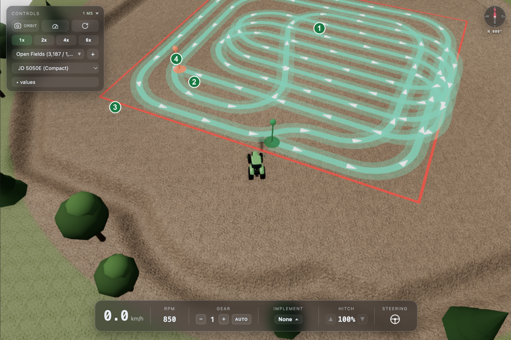
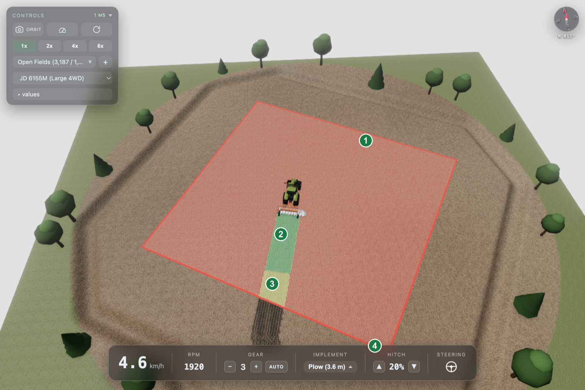

# SeamOS Hackathon 2026: The Master of Plowing — Participant Guide

> This document is the hands-on guide for SeamOS Hackathon 2026 participants.
> For the competition background and scoring criteria refer to the separate design document; this guide covers the end-to-end procedure from **repository setup → writing the RDDF → applying it to the app**.

---

## 1. Competition Overview

- **Mission**: Control a virtual tractor to plow the **"Alpha"** field with the **shortest time + maximum coverage**
- **Hard constraint**: Maximum driving speed **7 km/h** (an RDDF value above 7 km/h is rejected, never silently clamped)
- **Scoring**: a single REC-recorded CSV of the run produces a score **out of 100**.
  - Six items — **Coverage 45 · Duplicate 17 · Time 16 · Retread 9 · Outside 7 · Outside Time 6**
  - Each item's achievement (0–1) is **cubed** before it is multiplied by the item's points, so points accrue quickly only near a perfect score
  - Example: 50% coverage earns **5.6** of the 45 Coverage points (0.5³ = 12.5%)
  - There is **no hard cutoff** such as 95% — a score is produced at any coverage rate
- **INVALID**: manual driving, keyboard input, or changing the implement mid-run means **no score at all**

> **Key point**: What participants write and submit is the **RDDF (Route/Road Definition Data File)**.
> The tractor control algorithm itself is handled by the provided skeleton; participants express the **optimal route for plowing the field** as an RDDF and submit it.

---

## 2. Prerequisites

| Item | Purpose | Install |
|------|---------|---------|
| **SeamOS World (emulator)** | Where you actually drive an RDDF and check the score. **Install this first** | §2.1 below |
| **SeamOS IDE (FeatureDesigner)** | App build and FIF packaging | [docs.seamos.io/docs/3/5/1](https://docs.seamos.io/docs/3/5/1) |
| **Claude Code** | AI development agent | [claude.com/claude-code](https://claude.com/claude-code) |
| **SeamOS Everywhere** | Claude Code plugin (SeamOS development skill set) | [docs.seamos.io/docs/3/7/install-config](https://docs.seamos.io/docs/3/7/install-config) · [GitHub](https://github.com/AGMO-Inc/seamos-everywhere) |

If you are only authoring and submitting RDDFs, **SeamOS World alone is enough.** The IDE,
Claude Code and Everywhere are needed when you also modify the app code.

### 2.1 Installing SeamOS World

Supported operating systems are **macOS (Apple Silicon)** and **Ubuntu 22.04 or newer**. Only a
launcher script is installed; the 4.4 GB VM image downloads automatically on the first
`seamosworld start` (once).

**macOS (Apple Silicon)**

```bash
brew install agmo-inc/seamosworld/seamosworld
seamosworld start
```

**Ubuntu**

The first line registers the repository. You only need it once.

```bash
echo 'deb [trusted=yes] https://seamosworld-dist-795591862191.s3.ap-northeast-2.amazonaws.com/apt stable main' \
  | sudo tee /etc/apt/sources.list.d/seamosworld.list
sudo apt update && sudo apt install seamosworld
seamosworld start
```

Once it is up, open the dashboard at `http://localhost:3000`.

```bash
seamosworld status     # service status
seamosworld stop       # shut down
seamosworld --help     # all commands
```

> On x86_64 Ubuntu the CCU virtual machine runs under ARM software emulation (TCG) and uses a
> lot of CPU. More cores and higher clocks help. Minimum/recommended specs and real-world feel
> are in [system-requirements.md](docs/hackathon-2026/system-requirements.md).

---

## 3. Repository Structure

```
master_of_plow/
├── com.bosch.fsp.master_of_plow/            # FSP (Feature Spec Project)
├── com.bosch.fsp.master_of_plow.gen/        # Artifacts generated from the FSP
├── com.bosch.fsp.master_of_plow.gen.tests/  # Generated test artifacts
├── master_of_plow_app/                      # App body (C++ code, config)
│   ├── src-gen/AppMain/tracking/            # Path-tracking skeleton (§10)
│   └── tests/                               # Local test modules
├── master_of_plow_CPP_SDK/                  # SeamOS C++ SDK (provided)
├── customui-src/                            # Dashboard source (React + Vite)
├── docs/                                    # Run orchestration and FIF validation notes
├── distribution/                            # Distribution artifacts
├── seamos-assets/                           # Marketplace images and other assets
└── HACKATHON_GUIDE.md                       # This document (en · de · th translations included)
```

### 3.1 Opening in SeamOS IDE

1. Launch SeamOS IDE
2. **File → Open Project...**
3. Specify the cloned `master_of_plow/` path and open

### 3.2 Build Verification

Use SeamOS IDE to build the project and verify your environment is working correctly by running the app and tests.

#### 1. Perform the build

Click the **Build** button in the top toolbar and click **Build all** to build the entire project.
- SDK (SeamOS C++ SDK)
- App (app body)
- Test (local test module)

All three modules must build successfully.

#### 2. Package, install, and verify

Run the local tests, then use the organizer-provided SDK/Feature Designer (or
its CI pipeline) to produce the FIF. Install that FIF through the emulator's
normal install workflow. The user selects and starts the installed feature.
Copying a loose executable into the emulator is not a supported build or test
flow. Record the FIF and source hashes; see
`docs/official-fif-validation-workflow.md`.

---

## 4. What Is an RDDF?

**RDDF (Road Definition Data File)** is a **waypoint sequence** that the tractor follows.
It is the essential deliverable that participants submit in the competition, and it defines:

- Where to go (latitude/longitude)
- How fast to travel (speed)
- Forward/reverse (sign of speed)
- Whether to **engage or disengage** the implement at each point (implement flag)

### 4.1 File Format

**9 columns** separated by tabs (`\t`), one waypoint per line:

> The parser also accepts a **7-column form** without the leading `lineNo` and
> `index` (`RddfParser.cpp`). This guide and the sample files use 9 columns, which
> is what we recommend.

```
lineNo  index  lat         lon          res1  res2  res3  speed  implementFlag
1       1      35.8000317  126.8807033  0.0   0.0   0.0   3.00   1
2       2      35.8000317  126.8807141  0.0   0.0   0.0   3.00   1
...
22      22     35.8001131  126.8808124  0.0   0.0   0.0   -1.00  0
23      23     35.8001040  126.8808124  0.0   0.0   0.0   -1.00  0
```

| Column | Meaning |
|--------|---------|
| `lineNo` | Line number in the file (starts at 1, increments by 1) |
| `index` | Waypoint index (usually the same as lineNo) |
| `lat` | Latitude (decimal degrees, WGS84) |
| `lon` | Longitude (decimal degrees, WGS84) |
| `res1`, `res2`, `res3` | Reserved fields — always `0.0` |
| `speed` | Target speed (km/h). **Negative = reverse** |
| `implementFlag` | `1` = implement down (plowing on), `0` = implement up (turn/idle) |

### 4.2 Speed Rules

- `0 < speed ≤ 7.0` — forward; values below `2.05 km/h` load with a sustainable-speed warning
- `speed = 0` — an explicit stop waypoint
- `-7.0 ≤ speed < 0` — reverse. There is no reverse-specific penalty, but the stop/re-accelerate time and the duplicated work cost you points (§7.4); magnitudes below `2.05 km/h` warn
- When the speed sign changes between adjacent waypoints, this is a **gear change point** — waypoints must be arranged so that the heading (direction of travel) reverses

### 4.3 implementFlag

- While plowing on a lane: `1`
- While turning on the headland (field edge): `0`
- **All reverse segments must be `0`** — do not plow while reversing.
- Even during a headland turn, an implement passing over already-worked ground counts as `Retread` (§7.2)

### 4.4 Automatic Validation

RDDF is automatically validated as soon as it is received from the cloud. Format errors and safety-ceiling violations are **rejected and not saved**; physical tracking limitations load unchanged with warnings. The validation logic is defined in `RddfValidator.cpp`.

| Check | Description | On violation |
|-------|-------------|--------------|
| **Empty file** (Rule 4) | Zero waypoints | Reject |
| **Value validity** | `lat`, `lon` and `speed` must be finite (no NaN or inf) | Reject, naming the waypoint index |
| **implementFlag** | Only `0` or `1` is accepted | Reject, naming the actual value and waypoint index |
| **Speed ceiling** | `\|speed\| ≤ 7.0 km/h` | Reject above the ceiling |
| **Speed floor** | A nonzero magnitude below `2.05 km/h` | Load unchanged and warn |
| **Waypoint spacing** (Rule 3) | Distance between consecutive points is **at least 0.05 m and at most 5.0 m** | Reject, naming the offending waypoint pair and the actual distance |
| **Physical curvature** (Rule 6) | Curvature measured from the heading change over three consecutive points, compared against the tracking model's minimum turning radius | Load unchanged and warn about the tracking limit |

> The constants live in `RddfValidator.hpp`: `MIN_WAYPOINT_SPACING_M = 0.05`,
> `MAX_WAYPOINT_SPACING_M = 5.0`, `MAX_MACHINE_SPEED_KMH = 7.0`,
> `MIN_MACHINE_SPEED_KMH = 2.05`; the minimum turning radius is computed as
> `WHEELBASE_M / tan(WHEEL_MAX_RAD)` from the tracker constants.
> That warning threshold is fixed to the tracking model, so it **may differ from the minimum
> turning radius of the tractor you actually pick.** Design your route against the per-class
> `minimum turning radius` in [tractor-specs.md](docs/hackathon-2026/tractor-specs.md) — a corner
> can be undrivable even when no warning fires.
> Rejection **stops at the first violation**, so only one reason is reported at a time.

#### Behavior on rejection

- An **"RDDF Validation Error" dialog** is immediately shown in the simulator UI, displaying the rejection reason verbatim.
- Rejected RDDFs do not enter the pending list and are automatically deleted — **fix and re-upload**.
- If no dialog appears and the file enters the pending list normally, you can consider validation passed.

#### Start pose is a session safety gate

Static file validation does not invent a StartPoint or compare waypoint 0 with
it. The loader has no authoritative live map spawn. Before motion authority is
granted, the simulator/session must instead compare its actual fresh vehicle
pose with waypoint 0. Keep the map spawn and the first waypoint aligned.

> Note: The loader preserves every submitted speed exactly and rejects only
> magnitudes above `7.0 km/h`. Nonzero values below `2.05 km/h` are loaded; if
> the runtime controller applies its creep floor, that is reported in telemetry.

### 4.5 Map Information (Field Maps)

The competition uses **three maps (M1, M2, M3)**. All three share the **same GPS origin — `37.5665, 126.978`**.

| Map | id | Name | Map size | Drivable (driveArea) | Scored (workArea) |
|-----|----|------|----------|----------------------|-------------------|
| **M1** | `agri-1-plain` | Open Fields | 88 × 80 m | 3,187 m² | **1,499 m²** |
| **M2** | `agri-2-sloped` | Sloped Acres | 80 × 80 m | 2,132 m² | **1,947 m²** |
| **M3** | `agri-3-patch` | Patchwork Plots | 72 × 80 m | 1,575 m² | **1,356 m²** |

Only the inside of `workArea` is scored. `driveArea` is the drivable limit; beyond it lies a
1.4 m deep ditch — **once a wheel drops in, the tractor cannot get itself out.** All three maps
are completely flat.

#### Start position — align waypoint 0 with this

| Map | Start (lat, lon) | Heading | World (x, z) |
|-----|------------------|---------|--------------|
| **M1** | `37.5663023, 126.9780595` | `32.3°` | 5.25, 21.85 |
| **M2** | `37.5665036, 126.9783060` | `-48.1°` | 27.0, -0.4 |
| **M3** | `37.5662952, 126.9782923` | `-17.5°` | 25.79, 22.64 |

- Heading is **0° = north, clockwise** (`forward = (sin h, -cos h)`).
- The start coordinate is the **contact point of the rear-right wheel**, not the vehicle centre.
  Switch tractor size class and the rear-right wheel still lands exactly here.
- Motion authority is granted only once the live vehicle pose matches waypoint 0 (§4.4).

#### Converting world coordinates to lat/lon

Polygons in the map document are written in world `[x, z]` metres (**+x = east / -z = north**).
An RDDF needs lat/lon, so convert like this.

```
lat = 37.5665 - z / 110540
lon = 126.978 + x / (111320 x cos(37.5665°))
```

> Using `111320` for latitude shifts every scoring cell by 0.7%. Latitude **must** use
> **`110540`**. The leaderboard inverts the same formula onto 0.5 m scoring cells.

#### M1 · Open Fields


The simplest rectangular field — ideal for quickly validating a boustrophedon algorithm.

#### M2 · Sloped Acres


A complex 37-vertex polygon. Despite the name there is no slope. The long headland makes
U-turn handling awkward.

#### M3 · Patchwork Plots


An irregular field mixing concave and convex edges (54 vertices). A plain boustrophedon leaves
a lot unplowed, so you need polygon clipping and per-region handling.

#### Detailed specification documents

Full polygon coordinates, surface properties and tractor specs live in separate documents.

| Document | Contents |
|----------|----------|
| [maps.md](docs/hackathon-2026/maps.md) | Map sizes, GPS origin, **full `workArea`/`driveArea` polygon coordinates**, tillage scoring basis (0.2 m cells, 0.999 completion) |
| [tractor-specs.md](docs/hackathon-2026/tractor-specs.md) | Specs of the three tractors — **minimum turning radius, wheelbase, steering limits** |
| [implement-specs.md](docs/hackathon-2026/implement-specs.md) | Specs of the five implements (working width, working depth), draft force and tillage accumulation |
| [terrain.md](docs/hackathon-2026/terrain.md) | Surface properties — soil, friction coefficients, traction limits, rolling resistance |
| [rddf-format.md](docs/hackathon-2026/rddf-format.md) | RDDF format specification |
| [system-requirements.md](docs/hackathon-2026/system-requirements.md) | Participant PC requirements and per-OS (macOS · Ubuntu) installation |

---

## 5. RDDF Authoring Workflow

### 5.1 What You Produce

What you author is **a single `.rddf` file**. Put it wherever you like and name it whatever you
like. Make one per map and drive each map separately.

```
<your working folder>/
├── gen_rddf.py     # your own generator (any language)
├── m1.rddf         # route for M1
├── m2.rddf         # route for M2
└── m3.rddf         # route for M3
```

### 5.2 Writing an RDDF by Hand

For the simplest approach, open a text editor and write tab-delimited data directly.

```
1	1	35.8000317	126.8807033	0.0	0.0	0.0	3.00	1
2	2	35.8000317	126.8807141	0.0	0.0	0.0	3.00	1
3	3	35.8000317	126.8807249	0.0	0.0	0.0	3.00	1
```

> **Warning**: The delimiter must be a **tab (`\t`)** character. Mixing in spaces will cause the parser to reject the file.

### 5.3 Generating an RDDF with Code

Writing dozens to hundreds of waypoints by hand is impractical. The typical approach is to write a script that takes the **field geometry + algorithm parameters** (lane spacing, turn radius, etc.) as input and generates the RDDF. Any language works — this guide provides Python examples.

#### Example: skip-lane boustrophedon + semicircular U-turn

Divide the field into parallel lanes spaced by SWATH (implement width) and enter the
next lane at each end via a **forward semicircular U-turn**. Avoiding reverse saves the
stop-and-re-accelerate time.

**A plain back-and-forth into the adjacent lane is impossible.** That semicircle has a
radius of `SWATH / 2`, which at SWATH = 4 m is 2 m — well below the vehicle's minimum
minimum turning radius — of any tractor you can pick. The steering goes to full lock and the
vehicle still runs wide of the corner.

So the turns **skip lanes**. Turning into a lane `d` lanes away gives a radius of
`d × SWATH / 2`, and on every turn that must be **at least the minimum turning radius of the
tractor you will drive**. It differs per size class, so read it off the
`minimum turning radius` row in [tractor-specs.md](docs/hackathon-2026/tractor-specs.md) —
change tractor and this constraint changes with it.

Visiting the **front half and back half of the lanes alternately** guarantees this. With
7 lanes the visiting order is `0, 4, 1, 5, 2, 6, 3`; the gaps are 4, 3, 4, 3, 4, 3, so
even the tightest turn has a radius of `3 × 4 / 2 = 6 m`.

```
lane:   0    1    2    3    4    5    6
order:  1    3    5    7    2    4    6
        └──── front half ────┘└─ back half ─┘

  ↑ lane 0 ─────────╮
                    │  radius = (lane gap) × SWATH / 2  ≥ min turning radius
  ↓ lane 4 ─────────╯
```

The smallest gap equals `front-half lane count − 1`, so this pattern requires the field
to be wider than `2 × minimum turning radius + SWATH`. On a narrower field a semicircular
U-turn is not usable at all, and you have to consider an omega turn that leaves the
boundary (→ Outside deductions) or a three-point turn (→ a reverse segment).

#### Minimal working example (`gen_rddf.py`)

```python
"""
gen_rddf.py - skip-lane boustrophedon RDDF generator example
Use this as a starting point and evolve it into your own algorithm.
"""

import math

# --- Field origin and lat/lon conversion (all three contest maps share it) ---
LAT0, LON0 = 37.5665, 126.978
M_PER_DEG_LAT = 110540.0
M_PER_DEG_LON = 111320.0 * math.cos(math.radians(LAT0))

def to_latlon(x_m, y_m):
    return (LAT0 + y_m / M_PER_DEG_LAT,
            LON0 + x_m / M_PER_DEG_LON)

# --- Vehicle physical limits ---
# Set MIN_TURN_R to the minimum turning radius of the tractor you will drive.
#   See the "minimum turning radius" row in docs/hackathon-2026/tractor-specs.md
#   (small JD 5050E / medium JD 6100M / large JD 6155M all differ)
MIN_TURN_R  = 4.9      # e.g. large JD 6155M
MAX_SPACING = 5.0      # max spacing between waypoints (over this the file is rejected)

# --- Parameters ---
FIELD_W = 30.0     # field width, east-west (m)
FIELD_H = 50.0     # field length, north-south (m)
SWATH   = 4.0      # lane spacing = plow width (m)
STEP    = 1.0      # waypoint spacing (m) - must be <= MAX_SPACING
V_LANE  = 3.0      # lane speed (km/h)
V_TURN  = 2.5      # turn speed (km/h) - at or above the 2.05 creep floor
N_ARC   = 16       # segments per U-turn semicircle

assert STEP <= MAX_SPACING

n_lanes = int((FIELD_W - SWATH) // SWATH) + 1

# Turning straight into the adjacent lane gives a radius of SWATH/2, below the
# minimum. Alternating the front half with the back half keeps every gap at
# (half - 1) lanes or more.
half = (n_lanes + 1) // 2
order = []
for i in range(half):
    order.append(i)
    if i + half < n_lanes:
        order.append(i + half)

# Smallest turn radius used, and how far the semicircles reach beyond the lanes.
MIN_R_USED = (half - 1) * SWATH / 2.0
HEADLAND   = half * SWATH / 2.0
assert MIN_R_USED >= MIN_TURN_R, (
    f"field too narrow: turn radius {MIN_R_USED:.2f} m < {MIN_TURN_R} m")

# Leave a headland at each end so the semicircles stay inside the field.
Y_LO, Y_HI = HEADLAND, FIELD_H - HEADLAND

waypoints = []  # (x, y, speed, implementFlag)
lane_x = lambda k: SWATH / 2.0 + k * SWATH

for n, k in enumerate(order):
    x = lane_x(k)
    going_up = (n % 2 == 0)

    # (1) Straight lane - implement DOWN
    y0, y1 = (Y_LO, Y_HI) if going_up else (Y_HI, Y_LO)
    n_steps = max(2, int(abs(y1 - y0) / STEP) + 1)
    for i in range(n_steps):
        t = i / (n_steps - 1)
        waypoints.append((x, y0 + (y1 - y0) * t, V_LANE, 1))

    # (2) Semicircular U-turn into the next lane - implement UP
    if n == len(order) - 1:
        break
    x_next = lane_x(order[n + 1])
    r = abs(x_next - x) / 2.0
    assert r >= MIN_TURN_R, f"turn radius {r:.2f} m < {MIN_TURN_R} m"
    cx, cy = (x + x_next) / 2.0, y1
    th0 = math.pi if x_next > x else 0.0
    th1 = 0.0 if x_next > x else math.pi
    sign = 1.0 if going_up else -1.0            # bulge up at the top end, down at the bottom end
    # The last point (j = N_ARC) coincides with the next lane's first point.
    # Emitting the same coordinate twice gives spacing 0 and is rejected.
    for j in range(1, N_ARC):
        theta = th0 + (th1 - th0) * j / N_ARC
        waypoints.append((cx + r * math.cos(theta),
                          cy + sign * r * math.sin(theta),
                          V_TURN, 0))

# --- Write the RDDF file (tab-delimited, 9 columns) ---
with open("alpha.rddf", "w") as f:
    for idx, (x, y, v, flag) in enumerate(waypoints, 1):
        lat, lon = to_latlon(x, y)
        f.write(f"{idx}\t{idx}\t{lat:.7f}\t{lon:.7f}\t0.0\t0.0\t0.0\t{v:.2f}\t{flag}\n")

print(f"{len(waypoints)} waypoints, {n_lanes} lanes, "
      f"min turn R {MIN_R_USED:.1f} m, headland {HEADLAND:.1f} m")
```

#### Areas to evolve with your own algorithm

The script above handles only a **rectangular field with uniform lanes**, and it leaves
the headland strips (`HEADLAND` deep at each end) completely unplowed. To compete on
score you will need to replace the following with your own algorithm:

- **Non-rectangular field boundary handling** — clip lane lengths to fit non-rectangular field shapes
- **Filling the headland** — cover the strips the example leaves behind with a final separate pass. Left alone they come straight off your Coverage score
- **Finishing turns inside the field** — a semicircle that crosses the boundary costs you **Outside** for the area and **Outside Time** for the time (§7.2)
- **Minimizing duplication** — passing over an already-completed cell counts as **Duplicate**, and wheels sitting on worked ground count as **Retread** (§7.2)
- **Lane spacing / turn radius optimization** — shrinking the lane gap shortens the transitions, as long as every turn stays at or above your tractor's minimum turning radius. A smaller tractor loosens the radius constraint but also narrows the working width
- **Start/end point** — design the approach path from the map spawn point to the first lane
- **Minimizing unplowed areas** — separately handle small unplowed regions near corners and edges

### 5.4 Validation Checklist

Before sending an RDDF to the app, verify the following.

- [ ] Every line has exactly 9 columns with **tab delimiters**
- [ ] `lineNo` starts at 1 and increments without gaps
- [ ] Map/session start pose is aligned with waypoint 0 before motion authority (§4.4)
- [ ] Every `speed` has absolute value **at most 7.0 km/h** (below `2.05 km/h` warns)
- [ ] Spacing between consecutive waypoints is within **0.05 m ~ 5.0 m** — anything outside that range is rejected (§4.4 rule 3)
- [ ] Straight segments also carry points at **5 m or closer** — a long straight described by only its start and end point is rejected
- [ ] Curve segments are dense enough — the higher the curvature, the finer the subdivision
- [ ] When transitioning from reverse to forward, **heading reverses** (in-place rotation is not possible)
- [ ] All reverse segments have `implementFlag` = `0`
- [ ] Every turn radius is at least **your tractor's minimum turning radius** — anything tighter it physically cannot drive ([tractor-specs.md](docs/hackathon-2026/tractor-specs.md))
- [ ] The U-turn path does not stray outside the field boundary (Outside · Outside Time deductions, §7.2)

---

## 6. Applying the RDDF to the App

There are two ways to push your `.rddf` into the running app. Both ride **exactly the path the
cloud uses to deliver a file**, so from the app's point of view it is identical to the real
competition environment.

### 6.1 CLI — `seamosworld send-file`

The reliable way, and easy to chain right after your generator for repeat runs.

```bash
seamosworld send-file ./m1.rddf --draw-path
```

| Option | Meaning |
|--------|---------|
| `-f`, `--feature <id>` | Target feature id. Omitted, it goes to the running feature |
| `-n`, `--name <name>` | Filename the app sees. Omitted, the file's own name |
| `--draw-path` | Also draw the route as a green guidance line in the simulator |

To name the feature explicitly:

```bash
seamosworld send-file ./m1.rddf --feature NVX_FE_MOP_REF --draw-path
```

With `--draw-path` you can eyeball the route before driving it. Anything that runs outside the
field or a lane that came out misaligned is usually visible right here.



- **Green ribbon** — the RDDF you just sent. The white arrows are the direction of travel
- **Red outline** — the `workArea` boundary, the scored region (§4.5)
- `CONTROLS` at the top left selects the map and tractor. Time acceleration (1x–6x) is there too
- The bottom panel shows speed, gear, implement and hitch state

### 6.2 Drag and drop

Drag the `.rddf` file straight onto the simulator window. Handy for checking a single file.
Drop it anywhere on the view and the route draws immediately, exactly as above.

### 6.3 Verifying it landed

The app parses the file with `RddfParser` and runs the automatic validation from §4.4.

- If validation rejects it, an **"RDDF Validation Error" dialog** appears immediately with the
  reason verbatim. Fix it and send again.
- No dialog means it passed. Check in the simulator that the tractor follows the route you meant.
- Motion authority is granted only once the live vehicle pose matches waypoint 0 — the map spawn
  coordinates are in the §4.5 table.

### 6.4 Driving and recording (REC)

Once the route draws correctly, drive it for real.

1. Pick the **map** and **tractor** in `CONTROLS`. Minimum turning radius differs by size class,
   so pick the same tractor you designed the RDDF for
   ([tractor-specs.md](docs/hackathon-2026/tractor-specs.md)).
2. Attach the **implement**. Do not change it mid-run — that invalidates the record (§7.3).
3. **Turn REC on** and start driving.
4. When the run ends, stop REC and download the record. The submission file is the sealed
   **`.csv.enc`**; the plain CSV you also get is for your own analysis (§7.5).

**Do not touch the keyboard while REC is running.** Grabbing the steering or nudging the throttle
or brake even once invalidates the entire run (§7.3).

Here is what the screen looks like mid-run.



- **Translucent red area** — the `workArea`. Only what is inside this counts
- **Green strip** — ground past the completion threshold (tillage ratio 0.999)
- **Yellow strip** — passed over but not yet deep enough to count as complete. Lower the hitch
- The `IMPLEMENT` and `HITCH` readouts drive the actual working depth
  ([implement-specs.md](docs/hackathon-2026/implement-specs.md))

---

## 7. Competition Rules Summary

### 7.1 Mission Conditions

| Item | Value |
|------|-------|
| Start position | The **map's spawn point**. Motion authority is granted only once waypoint 0 of your RDDF matches it (§4.4) |
| Target fields | **M1 · M2 · M3** (§4.5) |
| Target threshold | **No hard cutoff** — a score is produced even at low coverage |
| Maximum speed | **7 km/h** |
| Implement | **Exactly one** per run — swapping it mid-recording invalidates the run |

### 7.2 Scoring (out of 100)

A **single CSV**, recorded with REC, produces the score. Areas differ from field to field,
so everything is normalised into **ratios (0–1)** before scoring.

```
cov  = min(1, total_worked_m2 / work_area_m2)   what % of the field you actually worked
dup  = duplicate_m2 / work_area_m2              what % of the field you wastefully worked twice
out  = outside_m2   / work_area_m2              what % worth of area you spilled outside
ret  = retread_m2   / total_worked_m2           what % of YOUR OWN worked ground is left tread on
outt = time outside the boundary / elapsed_s    what % of the run you spent outside the field
```

Each metric becomes an **achievement (0–1)**, which is then **cubed** and multiplied by
the item's points.

```
item score = points × achievement³

SCORE = 45·cov³ + 17·dup_a³ + 16·time_a³ + 7·out_a³ + 6·outt_a³ + 9·ret_a³
```

| Item | Metric | Full marks | Zero | Points |
|------|--------|-----------|------|--------|
| Coverage | `cov` | 100% | 0% | **45** |
| Duplicate | `dup` | ≤ 5% | ≥ 25% | **17** |
| Time | `v_eff` | ≥ 3.5 km/h | ≤ 0.5 km/h | **16** |
| Retread | `ret` | ≤ 5% | ≥ 20% | **9** |
| Outside | `out` | 0% | ≥ 10% | **7** |
| Outside Time | `outt` | 0% | ≥ 10% | **6** |

**The cube is decisive.** Points accrue quickly only when the achievement is near full marks.

| Achievement | 0.5 | 0.7 | 0.8 | 0.9 | 0.95 | 1.0 |
|-------------|-----|-----|-----|-----|------|-----|
| Share of points earned | 13% | 34% | 51% | 73% | 86% | 100% |

At 62% coverage, near-perfect scores on everything else still leave you under 60 points.
**Filling the field to the end matters more than anything else.**

#### Time is not seconds — it is effective working speed

Absolute seconds vary with field size and implement width, so they cannot be compared.
Instead we compute **the minimum distance needed to cover this field (`D_ideal`) and
divide it by the time actually taken**, giving a speed.

```
R       = tractor minimum turning radius (compact 3.2 / medium 4.0 / large 4.9 m)
W       = implement working width (m) — from the CSV's `# implement` line
S       = short side of the map polygon's minimum bounding rectangle (m)
N       = ceil(S / W)                              number of passes

D_ideal = work_area_m2 / W + (N − 1) × π × R       (m)
v_eff   = D_ideal / elapsed_s × 3.6                (km/h)
```

`elapsed_s` is `duration_ms / 1000` and is **sim time**, so running at an accelerated
rate does not shorten your record.

Full-marks times per map for a large tractor (`R = 4.9`) with a large plow (`W = 3.6`):

| Map | Scored area (m²) | `D_ideal` (m) | Full-marks time |
|-----|------------------|---------------|-----------------|
| M1 Open Fields | 1,499 | 570.5 | **587 s** (9m47s) |
| M2 Sloped Acres | 1,947 | 756.5 | **778 s** (12m58s) |
| M3 Patchwork Plots | 1,356 | 576.6 | **593 s** (9m53s) |

Changing tractor or implement changes `R` and `W`, and every one of these is recomputed.

### 7.3 INVALID Runs

If **any** of the following holds, no score is produced and the run is excluded from the ranking.

| Condition | How it is detected |
|-----------|--------------------|
| **Manual driving** | **One or more** telemetry rows with `manual == 1` |
| **Manual key input** | An `event_t_ms,edge,key` block **exists** |
| **Implement changed** | **Two or more** `# implement` lines |
| **Unscorable** | No `# work_area_m2` or no `# map` line |

Do not touch the keyboard while REC is running. Grabbing the steering or nudging the
throttle or brake even once invalidates the entire run. Finish any tractor or implement
change **before** you start recording.

### 7.4 Rules That Have Been Retired

These differ from earlier guidance. **The following three no longer apply.**

| Retired rule | Current state |
|--------------|---------------|
| **Reverse in the plowed area resets it to unplowed** | **Retired.** Measured reverse residue is near zero, and the cost of reversing already shows up in Time and Duplicate |
| **Timer runs 10× faster outside the field** | **Gone.** It was removed from the app too. Area outside the boundary now scores as **Outside**, and time outside as **Outside Time** |
| **Average path error added at the finish** | **Not a scoring item.** No formula such as `finalTimeS = elapsedS + penaltyS` exists |

Path tracking error is not scored directly, but a large error drifts you off the lane, which
lowers `cov` and raises `dup` and `ret` — so it hurts a great deal **indirectly**.

### 7.5 Evaluation Method

- Drive with **REC recording enabled** in the emulator and submit the saved run record to the leaderboard.
- The submission file is the **sealed `.csv.enc`**, openable only with the organizers' key. The plain CSV you also receive is for your own analysis.
- Locally measured time and area are for reference only; **the official record is the leaderboard value**.
- Per-map scores are summed using the **team name** as the key.

> The official announcement is the final authority on points, tolerances and the exact
> submission mechanism. The figures here are copied from the leaderboard scoring rules; if
> they change, the announcement wins.

### 7.6 Run / Connection / Team Name Rules (strictly enforced)

> Violating the rules below may result in that run being invalidated, and repeated violations may constitute grounds for disqualification.

- **You cannot perform two or more runs simultaneously within a single app (simulator instance).**
  - The previous run must be completely finished before starting the next run.
  - Do not upload a new RDDF or restart the simulator before the previous run has ended.
- **Parallel runs across multiple apps (instances) are allowed, but simultaneous runs with the "same team name + same map" combination are prohibited.**
  - Running different maps on separate apps simultaneously is OK (e.g., App A on Map 1, App B on Map 2).
  - **Running the same map with the same team name on two instances simultaneously is prohibited** — leaderboard aggregation breaks and the records will be invalidated.
- **Multiple browser connections are prohibited.**
  - Do not connect to the same app instance from **multiple browser tabs or windows simultaneously**.
  - Multiple connections can cause leaderboard aggregation errors, coordinate/timer mismatches, and result loss.
  - If you want to share the screen, use screen mirroring / screen sharing (no separate browser session).
- **Use the exact same team name for all map runs.**
  - Per-map scores are **summed using the team name as the key**, so a single-character difference will be treated as a separate team with separate scores.
  - Example: `Team-A`, `team-A`, and `Team A` (with a space) are all treated as different teams.
  - Finalize your team name before the first run and enter **exactly the same string** for all maps and all runs.

---

## 8. Recommended Workflow

```
[1] Clone repo & IDE Import & confirm build passes
        ↓
[2] Send one simple straight RDDF and observe tractor behaviour in the simulator
        ↓
[3] Algorithm design — decide lane width, headland handling, turn pattern
        ↓
[4] Write RDDF generator (e.g., gen_rddf.py) — implement your coverage algorithm
        ↓
[5] Validate generated RDDF against §5.4 checklist
        ↓
   ┌─→ [6] Apply to the app with seamosworld send-file (--draw-path to check the route)
   │        ↓
   │   [7] Turn on REC in the emulator and drive → check elapsed time / plowed area
   │        (no keyboard input while recording — one touch invalidates the run)
   │        ↓
   │   [8] Submit the saved run record to the leaderboard → confirm the record updated
   │        ↓
   └── [9] Tune algorithm / parameters → return to 4 or 6

   * Repeat the [6]–[9] loop until the deadline, updating the leaderboard each attempt.
   * Your team's best record (summed across maps) left on the leaderboard at the
     deadline is what gets evaluated.
   * If you get stuck between [2] and [3], read §10. Knowing how the tractor
     reacts to a path makes the algorithm design in [3] much easier.
```

---

## 9. FAQ

Questions are grouped by topic. `(§N)` at the end of each answer refers to the corresponding section in the body of this guide.

- [9.1 Submission & Evaluation](#91-submission--evaluation)
- [9.2 Validation & Errors](#92-validation--errors)
- [9.3 Path Design](#93-path-design)
- [9.4 Operational Rules](#94-operational-rules)
- [9.5 Environment & Tools](#95-environment--tools)

---

### 9.1 Submission & Evaluation

> **Q1.** Do you submit a single RDDF file, or one per map?

**Upload one per map.** The competition uses three maps, M1, M2 and M3; author an RDDF per map and drive each separately (sent per file, e.g. `seamosworld send-file ./m1.rddf` — there is no mapId parameter). Per-map scores are summed using the **team name** as the key. (§4.5, §7.5)

---

> **Q2.** Do you need 100% coverage to win?

**There is no threshold you must clear.** But Coverage carries the largest allocation at
45 points and its achievement is **cubed**, so a low coverage collapses your score.

| Coverage | Points earned (of 45) |
|---------:|----------------------:|
| 50% | 5.6 |
| 70% | 15.4 |
| 90% | 32.8 |
| 100% | 45.0 |

Spending a little extra time to fill the field to the end almost always pays. (§7.2)

---

> **Q3.** Is there a separate "final submission" step?

You must **submit the REC record (the sealed `.csv.enc`) to the leaderboard** for each run
before it counts. Submitting is the record update. Whatever your team has on the
leaderboard at the deadline is what gets evaluated, so keep the upload → drive → submit
loop going until then. (§7.5)

---

### 9.2 Validation & Errors

> **Q4.** I uploaded an RDDF but nothing happens in the simulator.

Check both possibilities below.

| Cause | Check / Action |
|-------|----------------|
| **Validation failure** | Check whether an "RDDF Validation Error" dialog appeared → fix the RDDF according to the reported reason and re-upload (§4.4) |
| **Previous track still active** | Confirm that the new RDDF has progressed past the pending list and that the **apply** step was not skipped |

---

> **Q5.** Why does the file validator not check the map StartPoint?

The application loader does not receive an authoritative live map spawn, so it
must not validate against an invented position. Start-pose alignment is checked
by the simulator/session safety gate before motion authority. (§4.4)

---

> **Q6.** Can I slightly exceed 7 km/h?

**No.** A value above 7.0 km/h is rejected explicitly; it is never silently
clamped. Nonzero values below 2.05 km/h are accepted with a warning because the
machine may apply its runtime creep floor. (§4.2, §4.4)

---

### 9.3 Path Design

> **Q7.** Does a route with lots of overlap help?

**It hurts, and it is directly deducted.** Passing over ground that has already reached the
completion threshold counts as **Duplicate**, worth 17 points.

- Up to **5% of the field earns full marks** — some implement overlap is normal practice to avoid unworked stripes
- Past **25% it scores zero**
- In between the achievement is cubed, so even 10% costs you a lot

`Time` takes a hit as well, so it is a double loss. (§7.2)

---

> **Q8.** May I use reverse during turns?

**Yes. The reverse-specific penalty has been retired.** (§7.4)

It rarely pays off, though.

- Every forward↔reverse switch **stops the vehicle completely and re-accelerates**, costing time outright → worse `Time`
- The segment you back over is ground you already covered, raising `Duplicate` and `Retread`
- `implementFlag` must be `0` on every reverse segment (§4.3)

Consider it only as an alternative to a three-point turn on a field too narrow for a
semicircular U-turn.

---

> **Q9.** It is convenient to swing the U-turn far outside the field — how bad is the penalty?

**There is no 10× timer.** Instead it is deducted through two separate items.

| Item | Metric | Zero at | Points |
|------|--------|---------|--------|
| Outside | area worked outside the boundary ÷ field area | 10% | 7 |
| Outside Time | time spent outside ÷ total time | 10% | 6 |

Both take **full marks only at 0%** — they are treated as pure defects that nothing forces
on you. The 13 combined points are modest, but turning outside also burns time, so `Time`
suffers too. Finishing the turn inside the boundary is the better play. (§7.2)

---

> **Q10.** How much does path tracking error affect the score?

**It is not a scored item.** No penalty seconds attach to the error itself. (§7.4)

The indirect effect is large, though. When the tractor drifts off the lane, cells that
should have been worked are missed (`cov` down), it strays into the neighbouring lane and
reworks covered ground (`dup` up), and its wheels sit on worked ground (`ret` up). Those
items carry 45 + 17 + 9 = 71 points between them.

The values visible from the app are the **LTD (lateral deviation)** on the dashboard and
the `cte` column in `/tmp/pp_trace.csv`. If that value keeps accumulating to one side on a
curve, that section exceeded the vehicle's tracking limit.

→ Reduce it by increasing **waypoint density on curves** and **minimizing heading jumps**. (§10.6)

---

### 9.4 Operational Rules

> **Q11.** Can I run two maps simultaneously on one device?

**Yes — but the same team name + same map combination is prohibited.**

- OK: App A runs M1 while App B runs M2 simultaneously
- NG: Two instances both run M1 under the same team name simultaneously
- NG: Multiple browser tabs connected to the same app instance

(§7.6)

---

> **Q12.** Can I change the team name mid-competition?

**It is strongly discouraged.** The team name is the key for summing per-map scores, so **even a single character difference** is treated as a separate team with separate scores. Finalize your team name before the first run and use exactly the same string across all maps and all runs. (§7.6)

---

### 9.5 Environment & Tools

> **Q13.** Can I freely build my own RDDF generator tool?

**Yes — no restrictions on language or tool.** Python, MATLAB, a custom algorithm — anything goes. The only requirement is that the final output is an `.rddf` file that satisfies the format described in this document. (§4.1)

---

> **Q14.** Can I modify the code (C++ app, path tracker, etc.)?

**Yes.** Participants may modify autonomy logic and parameters. Official
evaluation uses the participant's approved FIF/application build together with
the submitted RDDF, subject to the organizer's current rules. Package and
install that build only through the official FIF workflow (§3.2); do not assume
that an unapproved local or loose-binary build is eligible.

That said, **reading** the tracking code is encouraged. Knowing which paths the tractor follows well — and which ones make its error grow — directly improves the quality of your RDDF. §10 explains the structure and how to read it.

---

## 10. Advanced: Understanding the Path-Tracking Code (optional)

> The tracker is part of the participant application. Changes affect an official
> evaluation only when they are included in the participant's approved FIF build
> under the organizer's rules (§9.5 Q14). Reading it also helps explain which
> RDDF geometry the vehicle can follow reliably.

### 10.1 Where the Code Lives

Path tracking is collected in one place: `master_of_plow_app/src-gen/AppMain/tracking/`.

```
AppMain/tracking/
├── TrackerTypes.hpp      Frame/sign conventions + the exchanged data types  ← start here
├── IPathTracker.hpp      The contract a tracking algorithm must satisfy
├── PathTrackerBase.hpp   Base class that pre-implements the boilerplate
├── SpeedController.hpp   Gear/throttle/brake (shared by all algorithms)
├── SteeringController.hpp Publishes the steering command
├── TrackerFactory.*      Name → implementation
├── TrackerSwitch.*       Handles tracker switching at runtime
├── TrackingLoop.*        Control loop (GPS conversion, command publishing, telemetry)
├── SampleClock.hpp       Time base for the control cycle
├── ControlTimeGate.hpp   Control-cycle gate
├── GpsSampleStore.hpp    GPS sample storage
├── SignalFreshness.hpp   Signal freshness decision
├── ClockLog.hpp / ClockTelemetry.hpp  Timing diagnostics
└── impl/
    ├── PurePursuitTracker.*  Default tracker (the one that actually drives in the contest)
    └── StanleyTracker.*      A second worked example
```

Every comment is written in **both Korean and English**. Start at the top of
`TrackerTypes.hpp` — nothing else reads correctly until you know the conventions.

### 10.2 Frame and Signs — the First Thing to Learn

| Item | Convention |
|------|------------|
| Position | ENU metres `(x, z)`, **+x = East, +z = South**. Origin = waypoint 0 of the RDDF |
| Heading | `atan2(z, x)` radians. 0 = facing East, +π/2 = facing South |
| Steering | Positive = **left turn**. The frame is left-handed, so a left turn *decreases* heading |
| Speed | Waypoint speed is km/h and **signed** (negative = reverse); measured speed is m/s and **unsigned** |

The compass bearing from GPS (0 = North, clockwise) is converted into this frame
by the control loop.

### 10.3 One Control Tick

`TrackingLoop` repeats this every 100 ms (shorter in proportion to the simulation
speed multiplier):

```
isReady()  →  sense()  →  tracker->update()  →  act()  →  report()
  ready?     GPS→ENU      tracking algorithm    publish    telemetry / summary
```

`sense()` and `act()` are the agreement with the simulator and are identical for
every algorithm. The only part that changes is `update()`.

### 10.4 How the Default Tracker Chooses a Steering Angle

Despite the name, it is a **weighted sum of five terms**. The defaults are set so the
**pure-pursuit term leads (weight 0.7) and the rest only trim**. Pure pursuit already
corrects cross-track and heading error at once, so raising the auxiliary gains to match
corrects the same error three times over, pins the steering at its limit and produces the
S-weave.

| Term | Role |
|------|------|
| Curvature feedforward | Steering the path's own curvature demands (independent of error) |
| Heading error (HDE) | Aligns the vehicle with the path tangent |
| Lateral deviation (LTD) | Pulls the vehicle back onto the path. On lanes it is measured at the **predicted position 1.5 s ahead**; in turns, at the current position |
| Pure Pursuit | Arc toward the lookahead target — **the primary steer** (`ppWeightPp` default **0.7**) |
| Yaw-rate damping | Suppresses oscillation when the terms above overreact |

### 10.5 ★ Properties That Directly Affect RDDF Design

This is the most practical part of this section.

| Tracker property | Write your RDDF like this |
|------------------|---------------------------|
| Lookahead distance = **speed × 9 s**, clamped to `5 m ~ 20 m` (shorter on curves) | Curves with a radius tighter than this get cut on the inside. Ease sharp turns out, or space waypoints more densely |
| Curvature estimated as a weighted average over **5 consecutive points** around the closest one | Sparse waypoints degrade the curvature estimate, leaving arcs under-steered (§4.4 rule 4) |
| The implement is **3 m behind** the vehicle | `implementFlag` transitions fire when the implement passes, so allow ~3 m of margin at lane starts and ends |
| Tracking does not start until the vehicle is **within 3 m of waypoint 0** | Match your first waypoint to the map's point A (§4.4) |
| A forward↔reverse change **brakes to a full stop** | Every direction change costs a full stop plus re-acceleration, straight off `Time`, so forward-based turns win (§7.2) |
| Completion = **within 1 m** of the last waypoint **and** inside the last 10 waypoints | Make the last waypoint an unambiguous end point |
| Progress never regresses even if the path crosses itself | Skip-lane patterns are safe |

### 10.6 Observing Behaviour Locally

Running the app locally produces two diagnostic outputs.

- **`/tmp/pp_trace.csv`** — one row per control tick: vehicle pose, steering,
  lateral deviation (LTD), and **each of the five steering terms separately**, so it is
  immediately visible which one is running away. After a run, overlay the path
  and the actual trajectory in Python or a spreadsheet.
- **`PP_LOG ...`** (stderr) — a one-line summary per tick, for watching live in a
  terminal.

If `cte` keeps accumulating to one side through a curve, that curve's curvature
exceeds the tractor's physical limit. Before touching any gain, try **easing the
curvature in the RDDF** first.

### 10.7 Trying a Different Algorithm

A Stanley example implementation ships alongside the default tracker. One
environment variable switches between them:

```bash
PATH_TRACKER=stanley   # default is pure_pursuit
```

Adding your own algorithm takes three steps:

1. Create a class in `tracking/impl/` deriving from `PathTrackerBase` and
   implement `update()` and `isTrackComplete()` (copying `StanleyTracker` is the
   easiest start)
2. Add one line to the registry in `TrackerFactory.cpp`
3. Run with `PATH_TRACKER=<its name>`

`master_of_plow_app/tests/PathTrackerContractTest.cpp` exercises **every
registered tracker** automatically, so finishing step 2 puts your implementation
under test as well. Where googletest is installed, a `master_of_plow_app_tests`
target is built alongside the app.

Changes must pass the local suite and be included in the approved FIF before
they can be evaluated; loose executable replacement is never an official run.

---

## 11. Getting Help

- **Urgent inquiries**: Speak directly to the organizers at the on-site booth

Good luck.
