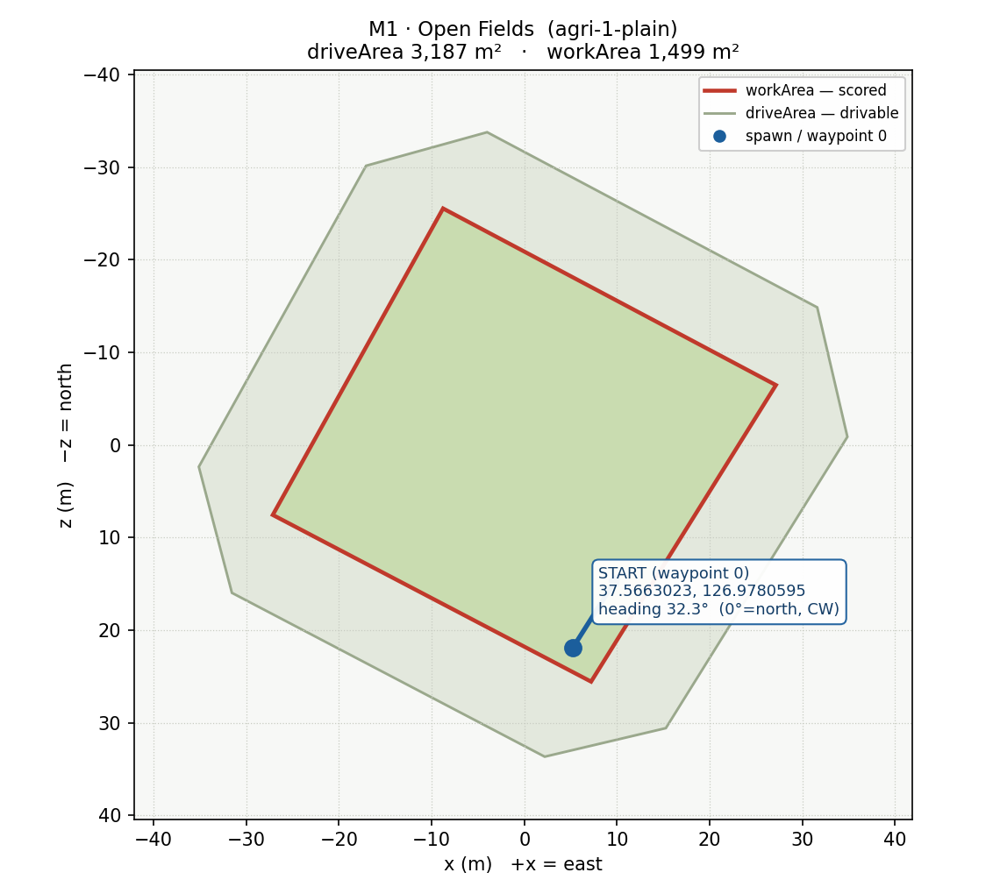
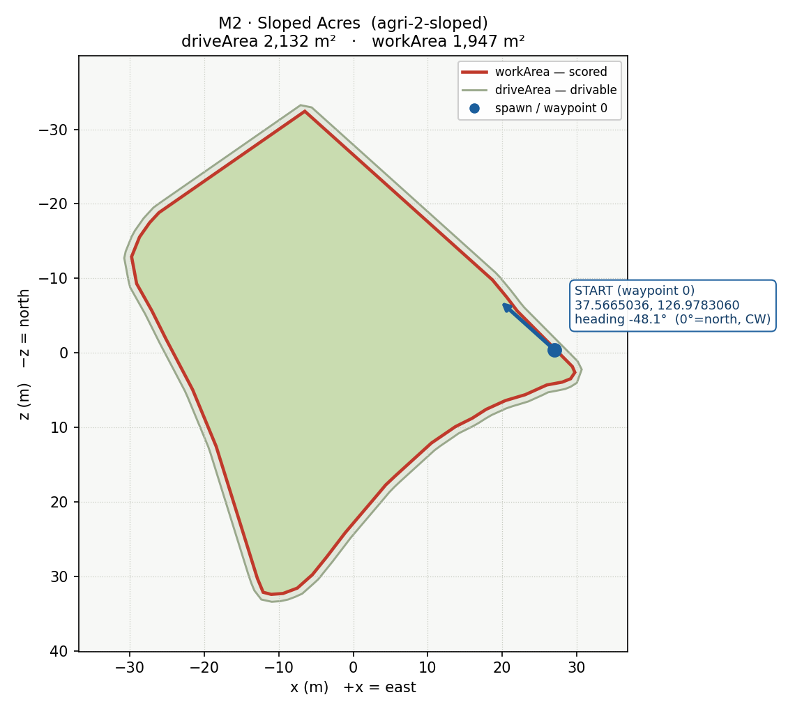
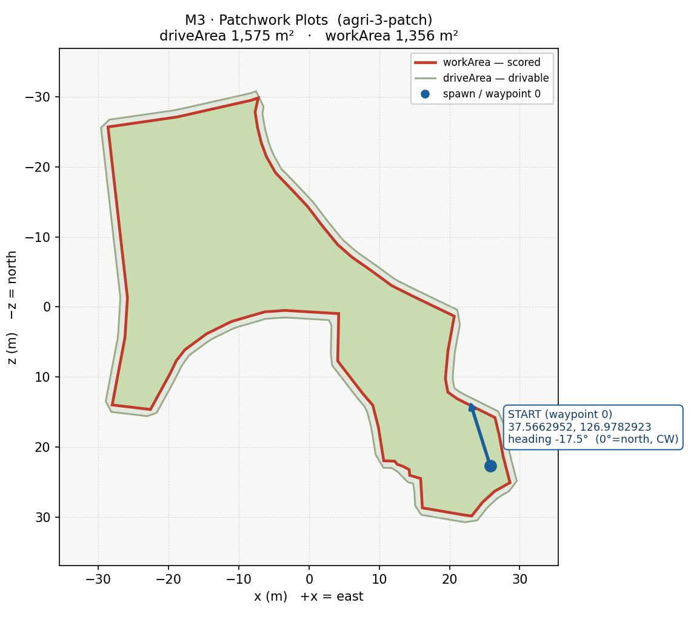

# SeamOS Hackathon 2026: The Master of Plowing — 참가자 가이드

> 본 문서는 SeamOS Hackathon 2026 참가자를 위한 실무 가이드입니다.
> 대회 배경과 평가 기준은 별도 기획서를, 본 문서는 **레포지토리 셋업 → RDDF 작성 → 앱에 반영**까지의 실행 절차를 다룹니다.

---

## 1. 대회 요약

- **미션**: 가상의 트랙터를 제어하여 농지 **"Alpha"** 구역을 **최단 시간 + 최대 면적**으로 쟁기질
- **하드 제약**: 최대 주행 속도 **7 km/h** (7 km/h 초과 RDDF 값은 클램핑하지 않고 거부)
- **채점**: 주행을 REC 으로 기록한 CSV 한 개로 **100점 만점** 점수를 냅니다.
  - 항목은 6개 — **Coverage 45 · Duplicate 17 · Time 16 · Retread 9 · Outside 7 · Outside Time 6**
  - 각 항목은 달성도(0~1)를 **세제곱**한 뒤 배점을 곱합니다. 만점 근처에서만 점수가 빠르게 붙습니다
  - 예: 커버리지 50% 면 Coverage 45점 중 **5.6점** (0.5³ = 12.5%)
  - 95% 같은 **하드 컷오프는 없음** — 면적률이 낮아도 점수는 산출됩니다
- **무효(INVALID)**: 수동 주행, 키보드 조작, 주행 중 작업기 교체는 **점수 미산출**

> **핵심**: 참가자가 작성/제출하는 것은 **RDDF(경로 정의 파일)** 입니다.
> 트랙터 제어 알고리즘 자체는 제공된 스켈레톤이 처리하며, 참가자는 **농지를 어떻게 갈 것인가에 대한 최적 경로**를 RDDF로 표현해 제출합니다.

---

## 2. 사전 준비물

| 항목 | 비고 |
|------|------|
| **SeamOS IDE (FeatureDesigner)** | 운영진 배포 버전 사용 |
| **Claude Code** | 공식 홈페이지 최신 버전 설치 |
| **SeamOS Everywhere** | 운영진 배포 버전 사용 |
| **SeamOS World (에뮬레이터)** | RDDF를 실제로 주행·확인하는 환경. 로컬 설치판 또는 `seamosworld.seamos.io` 사용 |


---

## 3. 레포지토리 구조

```
master_of_plow/
├── com.bosch.fsp.master_of_plow/         # FSP (Feature Spec Project)
├── com.bosch.fsp.master_of_plow.gen/     # FSP 에서 생성된 산출물
├── com.bosch.fsp.master_of_plow.gen.tests/  # 생성된 테스트 산출물
├── master_of_plow_app/                   # 앱 본체 (C++ 코드, 설정)
│   ├── src-gen/AppMain/tracking/         # 경로 추종 스켈레톤 (§10)
│   └── tests/                            # 로컬 테스트 모듈
├── master_of_plow_CPP_SDK/               # SeamOS C++ SDK (제공)
├── customui-src/                         # 대시보드 소스 (React + Vite)
├── rddf/                                 # 참가자가 작성/검증하는 RDDF 영역
├── docs/                                 # 실행 오케스트레이션 · FIF 검증 문서
├── distribution/                         # 배포 산출물
├── seamos-assets/                        # 마켓플레이스 이미지 등 자산
└── HACKATHON_GUIDE.md                    # 본 문서 (en · de · th 번역본 동봉)
```

### 3.1 SeamOS IDE에서 열기

1. SeamOS IDE 실행
2. **File → Open Project...**
3. 클론한 `master_of_plow/` 경로 지정 후 열기

### 3.2 빌드 확인

SeamOS IDE를 사용해 프로젝트를 빌드하고 앱 실행, 테스트 실행으로 환경이 정상인지 확인합니다.

#### 1. 빌드 수행

상단 툴바의 **Build** 버튼을 클릭하고 **Build all**을 클릭하여 전체 프로젝트 빌드를 수행합니다.
- SDK (SeamOS C++ SDK)
- App (앱 본체)
- Test (로컬 테스트 모듈)

세 개 모듈이 모두 빌드 성공되어야 합니다.

#### 2. 패키징·설치·확인

로컬 테스트를 실행한 뒤, 주최 측이 제공한 SDK/Feature Designer(또는 해당 CI
파이프라인)로 FIF를 생성합니다. 에뮬레이터의 정상 설치 절차로 FIF를 설치하고,
사용자가 설치된 feature를 선택해 시작합니다. 실행 파일만 에뮬레이터에 직접
복사하는 방식은 지원되는 빌드/검증 절차가 아닙니다. FIF와 소스 해시를 기록하고
`docs/official-fif-validation-workflow.md`를 참고하세요.

---

## 4. RDDF란?

**RDDF (Road Definition Data File)** 는 트랙터가 따라갈 **웨이포인트(waypoint) 시퀀스**입니다.
대회에서 참가자가 제출하는 본질적인 산출물이며, 다음을 정의합니다.

- 어디로 갈 것인가 (위도/경도)
- 얼마나 빠르게 갈 것인가 (속도)
- 전진/후진 (속도 부호)
- 그 지점에서 쟁기를 **내릴지/들지** (implement flag)

### 4.1 파일 포맷

탭(`\t`)으로 구분된 **9개 컬럼**, 한 줄에 한 웨이포인트:

> 파서는 앞의 `lineNo`·`index` 를 뺀 **7컬럼 형식도 받습니다**(`RddfParser.cpp`).
> 다만 본 가이드와 샘플 파일은 9컬럼 기준이므로 9컬럼을 권장합니다.

```
lineNo  index  lat         lon          res1  res2  res3  speed  implementFlag
1       1      35.8000317  126.8807033  0.0   0.0   0.0   3.00   1
2       2      35.8000317  126.8807141  0.0   0.0   0.0   3.00   1
...
22      22     35.8001131  126.8808124  0.0   0.0   0.0   -1.00  0
23      23     35.8001040  126.8808124  0.0   0.0   0.0   -1.00  0
```

| 컬럼 | 의미 |
|------|------|
| `lineNo` | 파일 내 라인 번호 (1부터 증가) |
| `index` | 웨이포인트 인덱스 (보통 lineNo와 동일) |
| `lat` | 위도 (decimal degrees, WGS84) |
| `lon` | 경도 (decimal degrees, WGS84) |
| `res1`, `res2`, `res3` | 예약 필드 — 항상 `0.0` |
| `speed` | 목표 속도 (km/h). **음수 = 후진** |
| `implementFlag` | `1` = 쟁기 내림(plowing on), `0` = 쟁기 들음(turn/idle) |

### 4.2 속도 규칙

- `0 < speed ≤ 7.0` — 전진. `2.05 km/h` 미만은 적재되지만 지속 불가능 속도 경고가 표시됨
- `speed = 0` — 명시적인 정지 웨이포인트
- `-7.0 ≤ speed < 0` — 후진. 후진 전용 패널티는 없지만 정지·재가속 시간과 중복 작업으로 점수가 깎입니다 (§7.4). 절대값 `2.05 km/h` 미만은 경고
- 인접 웨이포인트 간 속도 부호가 바뀌면 **기어 변경 지점** — 헤딩(진행 방향)이 반전되도록 배치해야 함

### 4.3 implementFlag

- 레인 위에서 쟁기질 중일 때: `1`
- 헤드랜드(field 가장자리)에서 선회 중일 때: `0`
- **후진 구간은 항상 `0`** — 후진하며 쟁기질하지 않습니다.
- 헤드랜드 선회 중에도 작업기가 기작업 면적을 밟으면 `Retread` 로 잡힙니다 (§7.2)

### 4.4 자동 검증 (Validation)

RDDF는 클라우드에서 수신되는 즉시 자동 검증을 거칩니다. 형식·안전 상한 위반은 **저장되지 않고 거부**되며, 추종 가능한 물리 한계는 파일을 그대로 적재한 채 경고합니다. 검증 로직은 `RddfValidator.cpp`에 정의되어 있습니다.

| 검사 | 내용 | 위반 시 |
|------|------|---------|
| **빈 파일** (Rule 4) | 웨이포인트가 0개 | 거부 |
| **값 유효성** | `lat` · `lon` · `speed` 가 유한한 수인가 (NaN · inf 불가) | 해당 웨이포인트 번호를 명시해 거부 |
| **implementFlag** | `0` 또는 `1` 만 허용 | 실제 값과 웨이포인트 번호를 명시해 거부 |
| **속도 상한** | `\|speed\| ≤ 7.0 km/h` | 초과 시 거부 |
| **속도 하한** | 0이 아닌 `2.05 km/h` 미만 | 원본 그대로 적재하고 경고 |
| **웨이포인트 간격** (Rule 3) | 인접 두 점의 거리가 **0.05 m 이상 5.0 m 이하** | 해당 웨이포인트 쌍과 실제 거리를 명시해 거부 |
| **물리 곡률** (Rule 6) | 연속 3점의 방위 변화로 곡률을 재고 차량 최소 회전 반경(약 **4.35 m**)과 비교 | 원본 그대로 적재하고 추종 한계 경고 |

> 상수는 `RddfValidator.hpp` 의 `MIN_WAYPOINT_SPACING_M = 0.05`,
> `MAX_WAYPOINT_SPACING_M = 5.0`, `MAX_MACHINE_SPEED_KMH = 7.0`,
> `MIN_MACHINE_SPEED_KMH = 2.05` 이고, 최소 회전 반경은
> `WHEELBASE_M / tan(WHEEL_MAX_RAD)` 로 트래커 상수에서 그대로 계산합니다.
> 거부는 **첫 위반 지점에서 즉시 중단**되므로, 한 번에 하나씩만 사유가 나옵니다.

#### 거부 시 동작

- 시뮬레이터 UI에 **"RDDF Validation Error" 다이얼로그**가 즉시 표시되며, 거부 사유가 그대로 노출됩니다.
- 거부된 RDDF는 pending 목록에 들어오지 않고 자동 삭제됩니다 — **다시 수정 후 업로드**해야 합니다.
- 다이얼로그가 뜨지 않고 정상적으로 pending 목록에 들어왔다면 검증 통과로 간주해도 됩니다.

#### 시작 자세는 세션 안전 게이트

정적 파일 검증은 StartPoint를 만들어내거나 웨이포인트 0과 비교하지 않습니다.
로더에는 신뢰할 수 있는 실시간 맵 spawn 정보가 없기 때문입니다. 주행 권한을
부여하기 전에 시뮬레이터/세션이 실제 최신 차량 자세와 웨이포인트 0을 비교해야
합니다. 맵 spawn과 첫 웨이포인트를 일치시키세요.

> 참고: 로더는 제출한 속도를 그대로 보존합니다. 절대값 `7.0 km/h` 초과는
> 거부됩니다. 0이 아닌 `2.05 km/h` 미만은 적재되며, 실제 제어기가 크리프
> 하한을 적용하면 텔레메트리에 표시됩니다.

### 4.5 맵 정보 (Field Maps)

대회 맵은 **4개**입니다. M1~M3 은 공개되어 있고, **M4 는 hidden** 으로 운영진이 공개하기 전까지 신호가 차단됩니다. 각 맵의 폴리곤(필드 경계)은 WGS84 `lat, lon` 좌표로 정의되며, 참가자의 RDDF는 해당 폴리곤 내부를 최대한 커버해야 합니다.

| 맵 | 이름 | Origin (lat, lon) | 면적 | 꼭지점 수 | 공개 |
|----|------|-------------------|------|-----------|------|
| **M1** | Open Fields | 35.8000, 126.8800 | 1,500 m² | 4 | 공개 |
| **M2** | Sloped Acres | 34.6800, 126.9100 | 1,948 m² | 37 | 공개 |
| **M3** | Patchwork Plots | 35.4200, 127.3900 | 1,355 m² | 54 | 공개 |
| **M4** | Crooked Bottoms | 35.2000, 127.4600 | 1,879 m² | 89 | **hidden** |

> M4 폴리곤은 운영진이 공개하는 시점에 배포됩니다. 그 전까지는 해당 맵의 신호가
> 차단되므로 미리 RDDF 를 만들 수 없습니다. 4개 맵 총면적은 6,682 m² 입니다.

> Origin은 폴리곤 로컬 (0, 0)에 대응하는 GPS 기준점(참고용)이고, 면적은 shoelace 공식으로 계산된 m² 값입니다.

#### M1 · Open Fields (1,500 m², 4 꼭지점)



가장 단순한 사각형 농지. 부스트로페돈 알고리즘을 빠르게 검증하기에 적합합니다.

```
polygon = [
  (35.8002897, 126.8806012), (35.8004622, 126.8802035),
  (35.8001628, 126.8800000), (35.8000000, 126.8803803),
]
```

#### M2 · Sloped Acres (1,948 m², 37 꼭지점)



경사 농지를 모사한 복잡한 다각형. 헤드랜드 영역이 길어 U-turn 처리가 까다롭습니다.

```
polygon = [
  (34.6805868, 126.9102540), (34.6804636, 126.9100401),
  (34.6804514, 126.9100264), (34.6804341, 126.9100117),
  (34.6804101, 126.9100000), (34.6803773, 126.9100074),
  (34.6803447, 126.9100296), (34.6803099, 126.9100506),
  (34.6802487, 126.9100895), (34.6801798, 126.9101240),
  (34.6800194, 126.9101844), (34.6800025, 126.9101929),
  (34.6800000, 126.9102047), (34.6800011, 126.9102220),
  (34.6800076, 126.9102429), (34.6800240, 126.9102651),
  (34.6800455, 126.9102861), (34.6800750, 126.9103133),
  (34.6801236, 126.9103631), (34.6801328, 126.9103724),
  (34.6801435, 126.9103860), (34.6801583, 126.9104057),
  (34.6801838, 126.9104396), (34.6802037, 126.9104747),
  (34.6802139, 126.9104994), (34.6802247, 126.9105198),
  (34.6802354, 126.9105480), (34.6802425, 126.9105771),
  (34.6802543, 126.9106086), (34.6802578, 126.9106314),
  (34.6802619, 126.9106436), (34.6802696, 126.9106499),
  (34.6802767, 126.9106461), (34.6802850, 126.9106363),
  (34.6803441, 126.9105654), (34.6803610, 126.9105499),
  (34.6803819, 126.9105290),
]
```

#### M3 · Patchwork Plots (1,355 m², 54 꼭지점)



오목/볼록이 섞인 비정형 농지. 단순 부스트로페돈으로는 미경지가 많이 남으므로 폴리곤 클리핑과 부분 영역별 처리가 필요합니다.

```
polygon = [
  (35.4205363, 127.3902241), (35.4205148, 127.3901085),
  (35.4205020, 127.3900000), (35.4202816, 127.3900305),
  (35.4202305, 127.3900267), (35.4201433, 127.3900066),
  (35.4201374, 127.3900667), (35.4201845, 127.3900979),
  (35.4202004, 127.3901073), (35.4202145, 127.3901207),
  (35.4202350, 127.3901547), (35.4202510, 127.3901941),
  (35.4202633, 127.3902458), (35.4202652, 127.3902776),
  (35.4202611, 127.3903620), (35.4201999, 127.3903605),
  (35.4201579, 127.3903998), (35.4201428, 127.3904155),
  (35.4201145, 127.3904243), (35.4200712, 127.3904327),
  (35.4200707, 127.3904499), (35.4200667, 127.3904538),
  (35.4200640, 127.3904632), (35.4200598, 127.3904727),
  (35.4200525, 127.3904733), (35.4200484, 127.3904905),
  (35.4200105, 127.3904933), (35.4200014, 127.3905578),
  (35.4200000, 127.3905707), (35.4200178, 127.3905879),
  (35.4200319, 127.3906068), (35.4200430, 127.3906307),
  (35.4200766, 127.3906202), (35.4201037, 127.3906140),
  (35.4201269, 127.3906073), (35.4201511, 127.3905483),
  (35.4201598, 127.3905333), (35.4201770, 127.3905294),
  (35.4202127, 127.3905333), (35.4202578, 127.3905433),
  (35.4202830, 127.3904800), (35.4202971, 127.3904454),
  (35.4203168, 127.3904127), (35.4203341, 127.3903826),
  (35.4203501, 127.3903605), (35.4203743, 127.3903364),
  (35.4203994, 127.3903132), (35.4204189, 127.3902909),
  (35.4204427, 127.3902630), (35.4204637, 127.3902486),
  (35.4204810, 127.3902407), (35.4205012, 127.3902347),
  (35.4205213, 127.3902308), (35.4205394, 127.3902358),
]
```

---

## 5. RDDF 작성 워크플로

### 5.1 디렉터리 구조

```
master_of_plow/rddf/
├── 1.rddf                  # 필드 1 경로
├── 2.rddf                  # 필드 2 경로
├── 3.rddf                  # 필드 3 경로
├── upload_rddf.sh          # 클라우드 업로드 스크립트
├── how-to-upload-rddf.md   # 업로드 명령어 메모
└── README.md               # 파일 규약과 검증 동작 요약
```

### 5.2 RDDF 직접 작성

가장 단순한 형태로 작성하려면 텍스트 에디터로 탭 구분 데이터를 직접 적습니다.

```
1	1	35.8000317	126.8807033	0.0	0.0	0.0	3.00	1
2	2	35.8000317	126.8807141	0.0	0.0	0.0	3.00	1
3	3	35.8000317	126.8807249	0.0	0.0	0.0	3.00	1
```

> **주의**: 구분자는 반드시 **탭(`\t`)** 입니다. 공백(스페이스)이 섞이면 파서가 거부합니다.

### 5.3 코드로 RDDF 생성하기

수십~수백 개 웨이포인트를 손으로 적기는 비현실적입니다. 일반적으로는 **농지 형상 + 알고리즘 파라미터**(레인 간격, 선회 반경 등)를 입력으로 받아 RDDF를 생성하는 스크립트를 작성합니다. 언어는 자유 — 본 가이드는 Python 예시를 제공합니다.

#### 예시: 레인 건너뛰기(skip-lane) 부스트로페돈 + 반원 U-turn

농지를 SWATH(쟁기 폭) 간격의 평행 레인으로 분할하고, 끝에서는 **전진 반원
U-turn** 으로 다음 레인에 진입합니다. 후진을 쓰지 않으므로 정지·재가속 시간을
아낄 수 있습니다.

**바로 옆 레인으로 도는 단순 왕복은 불가능합니다.** 옆 레인 반원의 반경은
`SWATH / 2` 인데, SWATH 가 4 m 면 반경 2 m 로 차량 최소 회전 반경 **4.35 m**
보다 작습니다. 조향이 끝까지 물려도 못 돌고 코너 밖으로 밀려납니다.

그래서 레인을 **건너뛰며** 돕니다. `d` 칸 떨어진 레인으로 돌면 반원 반경이
`d × SWATH / 2` 이므로, 모든 선회에서 이 값이 4.35 m 이상이어야 합니다.

레인을 **앞 절반과 뒤 절반으로 나눠 번갈아** 방문하면 이 조건이 항상 성립합니다.
레인이 7개면 방문 순서는 `0, 4, 1, 5, 2, 6, 3` 이고 인접 간격이 4·3·4·3·4·3 이라
가장 작은 선회 반경도 `3 × 4 / 2 = 6 m` 입니다.

```
레인:   0    1    2    3    4    5    6
순서:   1    3    5    7    2    4    6
        └──── 앞 절반 ────┘└─ 뒤 절반 ─┘

  ↑ 레인 0 ─────────╮
                    │  반경 = (간격 레인 수) × SWATH / 2  ≥ 4.35 m
  ↓ 레인 4 ─────────╯
```

간격의 최솟값은 `앞절반 레인 수 − 1` 이므로, 이 패턴이 성립하려면 농지가
`SWATH × (2 × 4.35 / SWATH + 1)` 보다 넓어야 합니다. 더 좁은 농지라면 반원
U-turn 자체를 쓸 수 없고, 경계 밖으로 나가는 Ω-turn(→ Outside 감점)이나
3점 선회(→ 후진 구간 발생)를 검토해야 합니다.

#### 최소 동작 예시 코드 (`gen_rddf.py`)

```python
"""
gen_rddf.py — 레인 건너뛰기 부스트로페돈 RDDF 생성 예제
참가자는 본 스크립트를 출발점으로 삼아 본인 알고리즘으로 발전시킨다.
"""

import math

# --- 농지 원점(좌하단)과 위경도 환산 ---
LAT0, LON0 = 35.8001, 126.8807
M_PER_DEG_LAT = 110540.0
M_PER_DEG_LON = 111320.0 * math.cos(math.radians(LAT0))

def to_latlon(x_m, y_m):
    return (LAT0 + y_m / M_PER_DEG_LAT,
            LON0 + x_m / M_PER_DEG_LON)

# --- 차량 물리 한계 (RddfValidator 와 같은 값) ---
MIN_TURN_R  = 4.35     # WHEELBASE_M 2.05 / tan(WHEEL_MAX_RAD 0.44)
MAX_SPACING = 5.0      # 인접 웨이포인트 최대 간격 (초과 시 파일 거부)

# --- 파라미터 ---
FIELD_W = 30.0     # 농지 동서 폭 (m)
FIELD_H = 50.0     # 농지 남북 길이 (m)
SWATH   = 4.0      # 레인 간격 = 쟁기 폭 (m)
STEP    = 1.0      # 웨이포인트 간격 (m) — MAX_SPACING 이하여야 함
V_LANE  = 3.0      # 레인 속도 (km/h)
V_TURN  = 2.5      # 선회 속도 (km/h) — 크리프 하한 2.05 이상
N_ARC   = 16       # U-turn 반원 분할 수

assert STEP <= MAX_SPACING

n_lanes = int((FIELD_W - SWATH) // SWATH) + 1

# 옆 레인으로 바로 돌면 반경이 SWATH/2 라 최소 회전 반경에 못 미친다.
# 앞 절반과 뒤 절반을 번갈아 방문하면 인접 간격이 항상 (half-1) 레인 이상이다.
half = (n_lanes + 1) // 2
order = []
for i in range(half):
    order.append(i)
    if i + half < n_lanes:
        order.append(i + half)

# 가장 작은 선회 반경과, 반원이 위아래로 튀어나오는 최대 깊이.
MIN_R_USED = (half - 1) * SWATH / 2.0
HEADLAND   = half * SWATH / 2.0
assert MIN_R_USED >= MIN_TURN_R, (
    f"field too narrow: turn radius {MIN_R_USED:.2f} m < {MIN_TURN_R} m")

# 선회 반원이 농지 밖으로 나가지 않도록 위아래로 헤드랜드를 비운다.
Y_LO, Y_HI = HEADLAND, FIELD_H - HEADLAND

waypoints = []  # (x, y, speed, implementFlag)
lane_x = lambda k: SWATH / 2.0 + k * SWATH

for n, k in enumerate(order):
    x = lane_x(k)
    going_up = (n % 2 == 0)

    # (1) 레인 직선 — 쟁기 ON
    y0, y1 = (Y_LO, Y_HI) if going_up else (Y_HI, Y_LO)
    n_steps = max(2, int(abs(y1 - y0) / STEP) + 1)
    for i in range(n_steps):
        t = i / (n_steps - 1)
        waypoints.append((x, y0 + (y1 - y0) * t, V_LANE, 1))

    # (2) 다음 레인으로 가는 반원 U-turn — 쟁기 OFF
    if n == len(order) - 1:
        break
    x_next = lane_x(order[n + 1])
    r = abs(x_next - x) / 2.0
    assert r >= MIN_TURN_R, f"turn radius {r:.2f} m < {MIN_TURN_R} m"
    cx, cy = (x + x_next) / 2.0, y1
    th0 = math.pi if x_next > x else 0.0
    th1 = 0.0 if x_next > x else math.pi
    sign = 1.0 if going_up else -1.0            # 위쪽 끝은 위로, 아래쪽 끝은 아래로
    # 마지막 점(j = N_ARC)은 다음 레인의 첫 점과 같은 자리이므로 넣지 않는다.
    # 같은 좌표가 두 번 들어가면 간격 0 으로 검증에서 거부된다.
    for j in range(1, N_ARC):
        theta = th0 + (th1 - th0) * j / N_ARC
        waypoints.append((cx + r * math.cos(theta),
                          cy + sign * r * math.sin(theta),
                          V_TURN, 0))

# --- RDDF 파일 출력 (탭 구분, 9컬럼) ---
with open("alpha.rddf", "w") as f:
    for idx, (x, y, v, flag) in enumerate(waypoints, 1):
        lat, lon = to_latlon(x, y)
        f.write(f"{idx}\t{idx}\t{lat:.7f}\t{lon:.7f}\t0.0\t0.0\t0.0\t{v:.2f}\t{flag}\n")

print(f"{len(waypoints)} waypoints, {n_lanes} lanes, "
      f"min turn R {MIN_R_USED:.1f} m, headland {HEADLAND:.1f} m")
```

#### 본인 알고리즘으로 발전시킬 포인트

위 스크립트는 **직사각형 농지 + 균일 레인** 만을 다루고, 위아래 헤드랜드
(`TURN_R` 폭)는 아예 갈지 않은 채로 남깁니다. 실제 점수 경쟁에서는 다음 항목을
본인 알고리즘으로 교체해야 합니다.

- **농지 경계 다각형 처리** — 직사각형이 아닌 농지 형상에 맞춰 레인 길이를 자르기
- **헤드랜드 채우기** — 위 예제가 남긴 위아래 띠를 마지막에 별도 패스로 갈기. 그냥 두면 Coverage 가 그만큼 깎입니다
- **선회를 농지 안에서 끝내기** — 반원이 경계를 넘어가면 그 면적이 **Outside**, 그 시간이 **Outside Time** 으로 감점됩니다 (§7.2)
- **중복 최소화** — 이미 완료된 셀을 다시 지나면 **Duplicate**, 기작업 면적을 바퀴로 밟고 있으면 **Retread** 로 감점됩니다
- **레인 간격 / 선회 반경 최적화** — 최소 회전 반경 **4.35 m** 를 만족하는 선에서 `LANE_SKIP` 을 줄이면 전이 거리가 짧아집니다
- **시작/종료 지점** — 맵 spawn 지점에서 첫 레인까지의 진입 경로 설계
- **미경지 최소화** — 코너·경계 부근의 작은 미경지 영역을 별도로 처리

### 5.4 검증 체크리스트

RDDF를 업로드하기 전 다음을 확인하세요.

- [ ] 9개 컬럼, **탭 구분**으로 모든 라인이 일관된가
- [ ] `lineNo`가 1부터 빠짐없이 증가하는가
- [ ] 주행 권한 전 맵/세션 시작 자세가 웨이포인트 0과 정렬되었는가 (§4.4)
- [ ] 모든 `speed`의 절대값이 **7.0 km/h 이하**인가 (`2.05 km/h` 미만은 경고 대상)
- [ ] 인접 웨이포인트 간격이 **0.05 m ~ 5.0 m** 범위인가 — 범위를 벗어나면 파일이 거부됩니다 (§4.4 규칙 3)
- [ ] 직선 구간도 **5 m 이하 간격**으로 점을 두었는가 — 긴 직선을 시작·끝 2점만으로 두면 거부됩니다
- [ ] 곡선 구간은 충분히 촘촘한가 — 곡률이 클수록 더 잘게 분할
- [ ] 후진 → 전진 전환 시 **헤딩이 반전**되는가 (제자리 회전 불가)
- [ ] 모든 후진 구간의 `implementFlag`가 `0`인가
- [ ] 선회 반경이 **4.35 m** 이상인가 — 그보다 급하면 트랙터가 물리적으로 못 돕니다 (§4.4)
- [ ] U-turn 경로가 농지 경계 밖으로 벗어나지 않는가 (Outside · Outside Time 감점, §7.2)

---

## 6. 앱에 RDDF 반영하기

### 6.1 클라우드 업로드

대회 평가는 **클라우드에 업로드된 RDDF**를 기준으로 동작합니다. 운영진이 발급한 환경 파일(Postman environment JSON)과 `FEU_ID`, `FEATURE_ID`를 사용해 업로드합니다.

> `--env`는 필수입니다. 환경 파일에는 `tokenUrl`, `baseUrl`, `cp_client_id`, `cp_client_secret`,
> `feature_id`, `feu_id` 키가 들어 있으며, `--feature-id` · `--feu-id`는 파일 값을 덮어쓰는 선택 옵션입니다.
> `jq`와 `curl`이 설치되어 있어야 합니다.

```bash
cd master_of_plow/rddf

# 실행 권한 부여 (최초 1회)
chmod +x ./upload_rddf.sh

# 업로드
./upload_rddf.sh \
  --env ./participant-env.json \
  -f ./1.rddf \
  --feu-id <YOUR_FEU_ID> \
  --feature-id <YOUR_FEATURE_ID>
```

성공 출력 예:

```
Uploaded ./1.rddf (HTTP 200).
```

#### 파라미터 형식

```
FEU_ID 예시      : abcdefgh-abcd-abcd-1234-abcd1234abcd
FEATURE_ID 예시  : 10234dev
```

#### 자주 발생하는 오류

| 증상 | 원인 / 해결 |
|------|-------------|
| `jq is required` | `sudo apt install jq` 또는 `brew install jq` |
| `Status: 401` | FEU_ID / FEATURE_ID 오타 또는 만료 — 운영진 문의 |
| `Status: 4xx` (파일 거부) | RDDF 포맷 오류 — 5.4 체크리스트 재검증 |
| `Status: 5xx` | 서버 일시 장애 — 잠시 후 재시도, 지속 시 운영진 문의 |

### 6.2 업로드 후 확인

업로드 후 앱은 `CloudDownloadListener`를 통해 RDDF를 받아 `RddfParser`로 파싱합니다. 시뮬레이터에서 트랙터가 의도한 경로를 따라가는지 확인합니다.

---

## 7. 대회 규칙 요약

### 7.1 미션 조건

| 항목 | 값 |
|------|-----|
| 시작 지점 | **맵의 spawn 지점**. RDDF의 첫 웨이포인트를 그 자리에 맞춰야 주행 권한이 나옵니다 (§4.4) |
| 목표 농지 | **M1 · M2 · M3** 공개, **M4** 는 hidden — 운영진 공개 전까지 신호 차단 (§4.5) |
| 목표 달성치 | **하드 컷오프 없음** — 커버리지가 낮아도 점수는 산출됩니다 |
| 최대 속도 | **7 km/h** |
| 작업기 | 한 주행에 **하나만** — 녹화 중 교체하면 무효 |

### 7.2 채점 (100점 만점)

주행을 REC 으로 기록한 **CSV 한 개**로 점수를 냅니다. 면적은 밭 크기마다 다르므로
전부 **비율(0~1)** 로 정규화한 뒤 채점합니다.

```
cov  = min(1, total_worked_m2 / work_area_m2)     갈아야 할 밭의 몇 %를 갈았나
dup  = duplicate_m2 / work_area_m2                밭 면적의 몇 %를 헛되이 두 번 갈았나
out  = outside_m2   / work_area_m2                밭 면적의 몇 %를 경계 밖에 흘렸나
ret  = retread_m2   / total_worked_m2             내가 갈아 놓은 땅 중 몇 %가 되밟힌 채 남았나
outt = 경계 밖 체류 시간 합 / elapsed_s            전체 작업 시간 중 몇 %를 밭 밖에서 보냈나
```

각 지표를 **달성도(0~1)** 로 환산한 뒤 **세제곱** 해서 배점을 곱합니다.

```
항목 점수 = 배점 × 달성도³

SCORE = 45·cov³ + 17·dup_a³ + 16·time_a³ + 7·out_a³ + 6·outt_a³ + 9·ret_a³
```

| 항목 | 지표 | 만점 기준 | 0점 기준 | 배점 |
|------|------|-----------|----------|------|
| Coverage | `cov` | 100% | 0% | **45** |
| Duplicate | `dup` | ≤ 5% | ≥ 25% | **17** |
| Time | `v_eff` | ≥ 3.5 km/h | ≤ 0.5 km/h | **16** |
| Retread | `ret` | ≤ 5% | ≥ 20% | **9** |
| Outside | `out` | 0% | ≥ 10% | **7** |
| Outside Time | `outt` | 0% | ≥ 10% | **6** |

**세제곱이 결정적입니다.** 달성도가 만점 기준 근처일 때만 점수가 빠르게 붙습니다.

| 달성도 | 0.5 | 0.7 | 0.8 | 0.9 | 0.95 | 1.0 |
|--------|-----|-----|-----|-----|------|-----|
| 배점 대비 획득 | 13% | 34% | 51% | 73% | 86% | 100% |

커버리지 62% 로 나머지를 거의 만점 받아도 총점은 60점을 넘기기 어렵습니다.
**밭을 끝까지 채우는 것이 다른 무엇보다 우선입니다.**

#### Time 은 초가 아니라 "유효 작업속도"

초 단위 절대 시간은 밭 크기·작업기 폭에 따라 달라져 비교가 안 됩니다. 그래서
**"이 밭을 최소 몇 m 주행하면 다 갈 수 있는가"(`D_ideal`)를 구한 뒤 실제 걸린
시간으로 나눠 속도로 환산**합니다.

```
R       = 트랙터 최소 선회 반경 (compact 3.2 / medium 4.0 / large 4.9 m)
W       = 작업기 작업폭 (m) — CSV 의 `# implement` 줄
S       = 맵 폴리곤의 최소 외접 사각형 짧은 변 (m)
N       = ceil(S / W)                              패스 수

D_ideal = work_area_m2 / W + (N − 1) × π × R       (m)
v_eff   = D_ideal / elapsed_s × 3.6                (km/h)
```

`elapsed_s` 는 `duration_ms / 1000` 이고 **심(sim) 시간**입니다. 배속으로 돌려도
기록이 줄지 않습니다.

대형 트랙터(`R = 4.9`) + 대형 쟁기(`W = 3.6`) 기준 맵별 만점 시간입니다.

| 맵 | 면적 (m²) | `D_ideal` (m) | 만점 시간 |
|----|-----------|---------------|-----------|
| M1 Open Fields | 1,500 | 570.5 | **587 s** (9분 47초) |
| M2 Sloped Acres | 1,948 | 756.5 | **778 s** (12분 58초) |
| M3 Patchwork Plots | 1,355 | 576.6 | **593 s** (9분 53초) |
| M4 Crooked Bottoms | 1,879 | 737.5 | **759 s** (12분 39초) |

트랙터나 작업기를 바꾸면 `R`·`W` 가 달라져 이 값이 전부 다시 계산됩니다.

### 7.3 무효(INVALID) 판정

아래 중 **하나라도** 해당하면 점수를 내지 않고 순위에서 제외합니다.

| 조건 | 검출 방법 |
|------|-----------|
| **수동 주행** | 텔레메트리에 `manual == 1` 인 행이 **1개 이상** |
| **수동 키 입력** | `event_t_ms,edge,key` 블록이 **존재** |
| **작업기 교체** | `# implement` 줄이 **2개 이상** |
| **채점 불가** | `# work_area_m2` 또는 `# map` 줄 없음 |

REC 중에는 키보드로 트랙터를 조작하지 마세요. 조향을 잡거나 가속·제동을 한 번만
건드려도 그 주행 전체가 무효입니다. 트랙터·작업기 변경도 녹화 시작 **전에**
끝내야 합니다.

### 7.4 폐지된 규칙

이전 안내와 달라진 부분입니다. **아래 세 가지는 더 이상 적용되지 않습니다.**

| 폐지된 규칙 | 현재 |
|-------------|------|
| 경작지 내 **후진 시 미경지 초기화** | **폐지.** 후진 잔존 면적은 실측에서 거의 0 이고, 후진 손실은 이미 Time·Duplicate 에 반영됩니다 |
| 농지 이탈 시 **타이머 10배속** | **없음.** 앱에서도 제거됐습니다. 대신 이탈 면적은 **Outside**, 이탈 시간은 **Outside Time** 으로 각각 채점합니다 |
| 완주 시 **평균 경로 오차 가산** | **채점 항목이 아닙니다.** `finalTimeS = elapsedS + penaltyS` 같은 산식은 존재하지 않습니다 |

경로 추종 오차 자체는 점수에 직접 들어가지 않지만, 오차가 크면 레인을 벗어나
`cov` 가 떨어지고 `dup`·`ret` 이 늘어나므로 **간접적으로 크게 불리합니다**.

### 7.5 평가 방식

- 주행은 에뮬레이터에서 **REC 으로 기록**하고, 저장된 주행 기록을 리더보드에 제출합니다.
- 제출용은 **봉인본(`.csv.enc`)** 이며 운영진 키로만 열립니다. 함께 받는 평문 CSV 는 본인 분석용입니다.
- 로컬에서 본 시간·면적은 참고용일 뿐이며, **공식 기록은 리더보드 값**입니다.
- 맵별 점수는 **팀 이름**을 키로 합산됩니다.

> 배점·허용치와 제출 방식의 세부는 운영진 공지가 최종 기준입니다. 본 문서의 수치는
> 리더보드 스코어링 규칙을 그대로 옮긴 것이며, 변경되면 공지가 우선합니다.

### 7.6 주행 / 접속 / 팀명 규칙 (엄수)

> 아래 규칙을 위반할 경우 해당 주행 기록은 무효 처리될 수 있으며, 반복 위반 시 실격 사유가 됩니다.

- **한 앱(시뮬레이터 인스턴스) 안에서 동시에 두 개 이상의 주행을 수행할 수 없습니다.**
  - 직전 주행이 완전히 종료된 뒤에 다음 주행을 시작해야 합니다.
  - 이전 주행이 끝나기 전 새 RDDF를 업로드하거나 시뮬레이터를 재기동하지 마세요.
- **여러 앱(인스턴스)으로 병렬 주행은 가능하지만, "같은 팀명 + 같은 맵" 조합의 동시 주행은 금지합니다.**
  - 서로 다른 맵을 각각의 앱에서 동시에 돌리는 것은 OK (예: 앱 A는 Map 1, 앱 B는 Map 2).
  - **같은 팀명으로 같은 맵을 두 인스턴스에서 동시에 주행하는 것은 금지** — 리더보드 집계가 깨지고 기록이 무효 처리됩니다.
- **다중 브라우저 연결 금지.**
  - 같은 앱 인스턴스에 **여러 브라우저 탭·창에서 동시에 접속하지 마세요.**
  - 다중 접속 시 리더보드 집계 오류, 좌표/타이머 불일치, 결과 누락이 발생할 수 있습니다.
  - 화면을 공유해서 보고 싶다면 화면 미러링 / 화면 공유 기능을 사용하세요 (별도 브라우저 세션 ✗).
- **모든 맵 주행 시 반드시 동일한 팀 이름을 사용하세요.**
  - 맵별 점수는 **팀 이름을 키로 합산**되므로, 한 글자라도 다르면 별개 팀으로 인식되어 점수가 분리됩니다.
  - 예: `Team-A`와 `team-A`, `Team A`(공백 포함)는 모두 다른 팀으로 처리됩니다.
  - 첫 주행 전에 팀명을 확정하고, 이후 모든 맵에서 **정확히 같은 문자열**을 입력하세요.

---

## 8. 추천 작업 흐름

```
[1] 레포 클론 & IDE Import & 빌드 통과 확인
        ↓
[2] rddf/1.rddf 샘플을 업로드해 시뮬레이터에서 트랙터 거동 관찰
        ↓
[3] 알고리즘 설계 — 레인 폭, 헤드랜드 처리, 선회 패턴 결정
        ↓
[4] RDDF 생성기 작성 (예: gen_rddf.py) — 본인 커버리지 알고리즘 구현
        ↓
[5] 생성된 RDDF → §5.4 체크리스트 통과 확인
        ↓
   ┌─→ [6] upload_rddf.sh로 클라우드 업로드
   │        ↓
   │   [7] 에뮬레이터에서 REC 을 켜고 주행 → 경과 시간 / 경운 면적 확인
   │        (녹화 중 키보드 조작 금지 — 한 번이라도 만지면 무효)
   │        ↓
   │   [8] 저장된 주행 기록을 리더보드에 제출 → 기록 갱신 확인
   │        ↓
   └── [9] 알고리즘 / 파라미터 튜닝 → 4 또는 6으로 복귀

   * 마감 시각까지 [6]~[9] 루프를 반복하며 매 시도마다 리더보드 기록을 갱신합니다.
   * 마감 시점에 리더보드에 남아있는 본인 팀의 최고 기록(맵별 합산)이 그대로
     평가 대상이 됩니다.
   * [2]와 [3] 사이에서 막히면 §10을 읽어 보세요. 트랙터가 경로에 어떻게
     반응하는지 알면 [3] 알고리즘 설계가 훨씬 쉬워집니다.
```

---

## 9. FAQ

질문은 주제별로 묶어 정리했습니다. 각 답변 끝의 `(§N)`은 관련 본문 섹션으로의 참조입니다.

- [9.1 제출과 평가](#91-제출과-평가)
- [9.2 검증과 에러](#92-검증과-에러)
- [9.3 경로 설계](#93-경로-설계)
- [9.4 운영 규칙](#94-운영-규칙)
- [9.5 환경과 도구](#95-환경과-도구)

---

### 9.1 제출과 평가

> **Q1.** RDDF 파일은 하나만 제출하나요? 아니면 맵별로?

**맵별로 각각 업로드.** 대회 맵은 4개이고 M1·M2·M3 이 공개(M4 는 hidden)이며, 맵마다 해당 RDDF 파일을 따로 업로드합니다(`upload_rddf.sh -f ./1.rddf` 처럼 파일 단위로 지정하며, 별도의 mapId 파라미터는 없습니다). 맵별 점수는 **팀 이름**을 키로 합산됩니다. (§4.5, §7.5)

---

> **Q2.** 면적률이 100%여야 우승할 수 있나요?

**통과해야 하는 임계치는 없습니다.** 다만 Coverage 는 45점으로 배점이 가장 크고
**달성도를 세제곱**해서 점수를 매기므로, 커버리지가 낮으면 점수가 급격히 무너집니다.

| 커버리지 | 획득 점수 (45점 만점) |
|---------:|----------------------:|
| 50% | 5.6 |
| 70% | 15.4 |
| 90% | 32.8 |
| 100% | 45.0 |

시간을 조금 더 쓰더라도 밭을 끝까지 채우는 쪽이 거의 항상 이득입니다. (§7.2)

---

> **Q3.** 별도의 "최종 제출" 절차가 있나요?

주행마다 **REC 기록(봉인본 `.csv.enc`)을 리더보드에 제출**해야 점수가 잡힙니다.
제출 자체가 곧 기록 갱신이며, 마감 시각에 리더보드에 남아 있는 본인 팀의 기록이
평가 대상입니다. 마감까지 업로드 → 주행 → 제출을 반복하세요. (§7.5)

---

### 9.2 검증과 에러

> **Q4.** RDDF를 업로드했는데 시뮬레이터에서 아무 일도 일어나지 않습니다.

두 가지 가능성을 확인하세요.

| 원인 | 확인 / 조치 |
|------|-------------|
| **검증 실패** | "RDDF Validation Error" 다이얼로그가 떴는지 확인 → 사유에 맞춰 RDDF 수정 후 재업로드 (§4.4) |
| **이전 트랙 잔존** | pending 목록까지는 들어왔는데 **apply** 단계가 누락되지 않았는지 확인 |

---

> **Q5.** 파일 검증기가 맵 StartPoint를 검사하지 않는 이유는 무엇인가요?

앱 로더에는 신뢰할 수 있는 실시간 맵 spawn 정보가 없습니다. 따라서 가상의
위치를 검사하지 않고, 주행 권한 전 시뮬레이터/세션 안전 게이트가 시작 자세를
웨이포인트 0과 비교합니다. (§4.4)

---

> **Q6.** 7 km/h를 약간 초과해도 되나요?

**안 됩니다.** 7.0 km/h 초과 값은 명시적으로 거부되며 클램핑되지 않습니다.
0이 아닌 2.05 km/h 미만 값은 파일을 거부하지 않지만, 기계가 지속적으로
유지하지 못해 런타임 크리프 하한이 적용될 수 있습니다. (§4.2, §4.4)

---

### 9.3 경로 설계

> **Q7.** Overlap이 많은 경로가 유리한가요?

**불리합니다. 그리고 직접 감점됩니다.** 이미 완료 기준을 넘긴 땅을 다시 지나면
**Duplicate** 로 잡히고, 배점이 17점입니다.

- 밭 면적의 **5% 까지는 만점** — 작업기 폭 겹침은 미작업 줄무늬를 막는 정상 운용입니다
- **25% 를 넘으면 0점**
- 그 사이는 달성도를 세제곱해 반영되므로 10% 만 되어도 손실이 큽니다

시간(`Time`)도 함께 깎이므로 이중으로 불리합니다. (§7.2)

---

> **Q8.** 선회 시 후진을 써도 되나요?

**써도 됩니다. 후진 전용 패널티는 폐지됐습니다.** (§7.4)

다만 이득이 되는 경우는 드뭅니다.

- 전진↔후진 전환마다 **완전 정지 후 재가속** 이라 시간이 통째로 듭니다 → `Time` 손해
- 되돌아가는 구간은 이미 간 땅을 다시 지나므로 `Duplicate`·`Retread` 가 늘어납니다
- 후진 구간의 `implementFlag` 는 `0` 이어야 합니다 (§4.3)

반원 U-turn 을 쓸 공간이 없는 좁은 농지에서 3점 선회의 대안으로만 검토하세요.

---

> **Q9.** U-turn을 농지 밖으로 크게 도는 게 편한데, 패널티가 어느 정도인가요?

**타이머 10배속은 없습니다.** 대신 두 항목으로 나뉘어 감점됩니다.

| 항목 | 지표 | 0점 기준 | 배점 |
|------|------|----------|------|
| Outside | 경계 밖을 갈아엎은 면적 ÷ 밭 면적 | 10% | 7 |
| Outside Time | 경계 밖 체류 시간 ÷ 전체 시간 | 10% | 6 |

둘 다 **만점 기준이 0%** 입니다 — 강제되지 않는 순수 결함으로 보기 때문입니다.
합쳐 13점이라 배점 자체는 크지 않지만, 경계 밖 선회는 그만큼 시간도 쓰므로
`Time` 까지 함께 깎입니다. 경계 안쪽에서 선회를 마무리하는 편이 유리합니다. (§7.2)

---

> **Q10.** 경로 추종 오차는 점수에 얼마나 영향이 큰가요?

**직접 채점되는 항목은 아닙니다.** 오차 자체에 붙는 가산 초는 없습니다. (§7.4)

다만 간접 영향이 큽니다. 트랙터가 레인에서 벗어나면 갈려야 할 셀이 안 갈리고
(`cov` 하락), 옆 레인을 침범해 이미 간 땅을 다시 갈며(`dup` 상승), 기작업 면적을
바퀴로 밟은 채 남습니다(`ret` 상승). 배점 45 + 17 + 9 = 71점이 걸린 항목들입니다.

앱에서 볼 수 있는 값은 대시보드의 **LTD(횡방향 편차)** 와 `/tmp/pp_trace.csv` 의
`cte` 컬럼입니다. 이 값이 곡선 구간에서 한쪽으로 계속 쌓이면 그 구간이 차량의
추종 한계를 넘었다는 뜻입니다.

→ **곡선 구간 웨이포인트 밀도**와 **헤딩 점프 최소화**로 줄일 수 있습니다. (§10.6)

---

### 9.4 운영 규칙

> **Q11.** 한 디바이스에서 두 개의 맵을 동시에 돌려도 되나요?

**가능 — 단 "같은 팀명 + 같은 맵" 조합은 금지.**

- OK: 앱 A에서 M1, 앱 B에서 M2 동시 실행
- NG: 같은 팀명으로 두 인스턴스에서 동시에 M1 실행
- NG: 같은 앱 인스턴스에 여러 브라우저 탭으로 접속

(§7.6)

---

> **Q12.** 팀 이름을 중간에 바꿔도 되나요?

**권장하지 않습니다.** 팀명은 맵별 점수 합산의 키이므로 **한 글자라도 다르면** 별개 팀으로 인식되어 점수가 분리됩니다. 첫 주행 전에 팀명을 확정하고 모든 맵·모든 주행에서 정확히 같은 문자열을 사용하세요. (§7.6)

---

### 9.5 환경과 도구

> **Q13.** RDDF 작성 도구를 자유롭게 만들어도 되나요?

**네 — 도구·언어 제약 없음.** Python, MATLAB, 자체 알고리즘 무엇이든 OK. 최종 산출물이 본 문서의 포맷을 만족하는 `.rddf` 파일이면 됩니다. (§4.1)

---

> **Q14.** 코드(C++ 앱, 경로 추종 트래커 등)를 수정해도 되나요?

**가능합니다.** 참가자는 자율주행 로직과 파라미터를 수정할 수 있습니다. 공식
평가는 운영진의 최신 규칙에 따라 참가자가 승인받은 FIF/앱 빌드와 제출 RDDF를
함께 사용합니다. 변경 사항은 §3.2의 공식 FIF 절차로 패키징·설치해야 하며,
승인되지 않은 로컬 빌드나 실행 파일 직접 교체는 평가 대상이라고 가정하면 안 됩니다.

다만 추종 코드를 **읽는 것**은 권장합니다. 트랙터가 어떤 경로를 잘 따라가고 어떤 경로에서 오차가 커지는지 알면 RDDF 설계 품질이 직접 올라갑니다. 구조와 읽는 법은 §10에 정리해 두었습니다.

---

## 10. 심화: 경로 추종 코드 이해하기 (선택)

> 트래커는 참가자 앱의 일부입니다. 변경 사항은 운영진 규칙에 맞는 참가자 승인
> FIF 빌드에 포함되어야 공식 평가에 반영될 수 있습니다(§9.5 Q14). 코드를 읽으면
> 차량이 안정적으로 추종할 수 있는 RDDF 형상도 더 잘 이해할 수 있습니다.

### 10.1 코드 위치와 계층

경로 추종은 `master_of_plow_app/src-gen/AppMain/tracking/` 한 곳에 모여 있습니다.

```
AppMain/tracking/
├── TrackerTypes.hpp      좌표계·부호 규약 + 주고받는 데이터 타입  ← 여기부터 읽으세요
├── IPathTracker.hpp      추종 알고리즘이 지켜야 할 계약(인터페이스)
├── PathTrackerBase.hpp   반복 코드를 미리 구현한 기반 클래스
├── SpeedController.hpp   기어/스로틀/브레이크 (알고리즘 공통)
├── SteeringController.hpp 조향 명령 발행
├── TrackerFactory.*      이름 → 구현 선택
├── TrackerSwitch.*       실행 중 트래커 전환 처리
├── TrackingLoop.*        제어 루프 (GPS 변환, 명령 발행, 텔레메트리)
├── SampleClock.hpp       제어 주기 시각 기준
├── ControlTimeGate.hpp   제어 주기 게이트
├── GpsSampleStore.hpp    GPS 샘플 보관
├── SignalFreshness.hpp   신호 신선도 판정
├── ClockLog.hpp / ClockTelemetry.hpp  타이밍 진단
└── impl/
    ├── PurePursuitTracker.*  기본 트래커 (실제로 대회에서 주행하는 것)
    └── StanleyTracker.*      두 번째 구현 예제
```

모든 주석은 **한국어와 영어를 함께** 달아 두었습니다. 좌표계 규약을 모르면 나머지가
읽히지 않으니 `TrackerTypes.hpp` 상단부터 시작하세요.

### 10.2 좌표계와 부호 — 가장 먼저 알아야 할 것

| 항목 | 규약 |
|------|------|
| 위치 | ENU 미터 `(x, z)`, **+x = 동쪽, +z = 남쪽**. 원점은 RDDF의 0번 웨이포인트 |
| 방향 | `atan2(z, x)` 라디안. 0 = 동쪽, +π/2 = 남쪽 |
| 조향 | 양수 = **좌회전**. 왼손 좌표계이므로 좌회전은 방향값을 *감소*시킵니다 |
| 속도 | 웨이포인트는 km/h **부호 있음**(음수=후진), 측정 속력은 m/s **부호 없음** |

GPS가 주는 나침반 방위(0=북, 시계방향)는 제어 루프가 위 좌표계로 변환해 줍니다.

### 10.3 한 번의 제어 주기

`TrackingLoop`이 100 ms마다(시뮬레이션 배속을 올리면 그만큼 짧아짐) 이 순서를 반복합니다.

```
isReady()  →  sense()  →  tracker->update()  →  act()  →  report()
   준비 확인    GPS→ENU 변환   추종 알고리즘      명령 발행   텔레메트리·기록
```

`sense()`와 `act()`는 시뮬레이터와의 약속이라 모든 알고리즘에서 동일하고,
바뀌는 곳은 `update()` 하나입니다.

### 10.4 기본 트래커가 조향을 정하는 방식

이름은 Pure Pursuit이지만 실제로는 **다섯 항의 가중합**입니다. 기본값은
**Pure Pursuit 항이 주도하고(가중치 0.7) 나머지는 거들기만 하도록** 잡혀 있습니다.
Pure Pursuit 는 이미 횡편차와 방향 오차를 동시에 잡으므로, 보조 항들의 게인을
같이 올리면 같은 오차를 세 번 보정하게 되고 조향이 상한에 붙어 S자 사행이 납니다.

| 항 | 역할 |
|----|------|
| 곡률 피드포워드 | 경로 자체의 곡률을 따라가는 조향 (오차와 무관) |
| 방향 오차 | 차량 방향을 경로 접선에 맞춤 |
| LTD(횡방향 편차) | 경로에서 벗어난 거리를 되돌림. 레인 구간에서는 **1.5초 후 예측 위치** 기준, 선회 구간에서는 현재 위치 기준 |
| Pure Pursuit | 전방 목표점을 향한 원호 — **주 조향** (`ppWeightPp` 기본값 **0.7**) |
| yaw rate 감쇠 | 위 항들이 과하게 반응했을 때 진동 억제 |

### 10.5 ★ RDDF 설계에 직접 영향을 주는 성질

여기가 이 섹션에서 가장 실용적인 부분입니다.

| 트래커의 성질 | RDDF를 이렇게 쓰세요 |
|---------------|----------------------|
| 전방 주시 거리 = **속도 × 9 s**, `5 m ~ 20 m` 로 제한 (곡선에서는 더 짧아짐) | 이 거리보다 짧은 반경의 곡선은 안쪽으로 잘립니다. 급회전은 완만하게 풀거나 웨이포인트를 촘촘히 |
| 곡률을 최근접점 주변 **연속 5점**의 가중평균으로 추정 | 웨이포인트 간격이 듬성하면 곡률 추정이 나빠져 원호에서 조향이 부족해집니다 (§4.4 규칙 4) |
| 작업기는 차량보다 **3 m 뒤** | `implementFlag` 전환 지점은 작업기가 지나는 시점 기준으로 잡히므로, 레인 시작·끝에서 3 m 여유를 고려하세요 |
| 첫 웨이포인트 **3 m 이내** 진입 전에는 추종 시작 안 함 | 첫 웨이포인트를 맵의 A 지점에 맞추세요 (§4.4) |
| 전진↔후진 전환 시 **완전 정지까지 제동** | 방향 전환 1회마다 정지·재가속 시간이 통째로 듭니다. `Time` 이 직접 깎이므로 전진 기반 선회가 유리합니다 (§7.2) |
| 완주 판정 = 마지막 웨이포인트 **1 m 이내** + **마지막 10개 웨이포인트 안**에 진입 | 마지막 웨이포인트를 애매하게 두지 말고 명확한 종료점으로 두세요 |
| 경로가 자기 자신과 교차해도 진행도는 되돌아가지 않음 | 레인을 건너뛰며 짜는 패턴도 안전합니다 |

### 10.6 로컬에서 거동 관찰하기

앱을 로컬 실행하면 두 가지 진단 출력이 나옵니다.

- **`/tmp/pp_trace.csv`** — 제어 주기마다 한 줄. 차량 위치, 조향, LTD(횡방향 편차),
  그리고 **조향 다섯 항이 각각 따로** 기록됩니다. 어느 항이 폭주하는지 바로 보입니다.
  주행이 끝나면 파이썬이나 스프레드시트로 경로와 실제 궤적을 겹쳐 보세요.
- **`PP_LOG ...`** (표준에러) — 주기마다 한 줄 요약. 터미널에서 실시간으로 따라갈 때.

곡선 구간에서 `cte`가 계속 한쪽으로 쌓이면 그 구간의 곡률이 트랙터의 물리적
한계를 넘었다는 신호입니다. 게인을 만지기 전에 **RDDF의 곡률을 먼저 완만하게**
해 보세요.

### 10.7 다른 알고리즘을 시험해 보기

기본 트래커 외에 Stanley 예제 구현이 함께 들어 있습니다. 환경변수 하나로 바꿉니다.

```bash
PATH_TRACKER=stanley   # 기본값은 pure_pursuit
```

새 알고리즘을 직접 붙이려면 세 단계입니다.

1. `tracking/impl/` 에 `PathTrackerBase`를 상속한 클래스를 만들고 `update()`와
   `isTrackComplete()`를 구현합니다 (`StanleyTracker`를 복사해 시작하면 편합니다)
2. `TrackerFactory.cpp` 레지스트리에 한 줄 추가
3. `PATH_TRACKER=<이름>` 으로 실행

`master_of_plow_app/tests/PathTrackerContractTest.cpp`는 **등록된 모든 트래커**를
자동으로 검사하므로, 2단계를 마치면 새 구현도 테스트 대상에 포함됩니다. googletest가
설치된 환경에서는 `master_of_plow_app_tests` 타깃이 함께 빌드됩니다.

변경 사항은 로컬 테스트를 통과하고 승인된 FIF에 포함되어야 평가할 수 있습니다.
실행 파일 직접 교체는 공식 실행이 아닙니다.

---

## 11. 도움 요청

- **긴급 문의**: 현장 부스 운영진에게 직접

행운을 빕니다.
