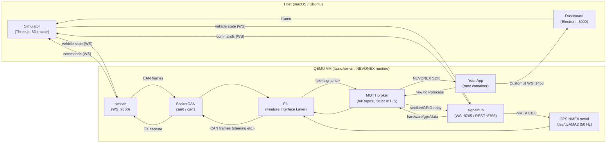

# CCU ↔ 시뮬레이터 신호 흐름 (Signal Flow)

2026 Agritechnica 해커톤 참가자용 문서입니다. SimulationWorld에서 **내 앱이 센서 신호를 받는 경로**와 **내 앱이 지령을 보내는 경로**가 어떻게 이어지는지 설명합니다.

핵심 원칙: QEMU VM 안에는 실제 Bosch CCU와 동일한 NEVONEX 소프트웨어 스택(FIL·SDK·MQTT)이 그대로 돌아갑니다. 시뮬레이터는 실디바이스의 "트랙터 하드웨어" 역할만 대신하므로, **앱 입장에서는 실디바이스와 동일한 경로로 신호가 오갑니다.**

---

## 전체 신호 흐름도



---

## 1. 신호를 받는 경로 (시뮬레이터 → 내 앱)

시뮬레이터가 계산한 차량 상태(위치·속도·조향각·IMU 등)는 두 갈래로 VM에 들어갑니다.

### CAN 신호 경로

```
Simulator → simcan (WS :9600) → SocketCAN can0/can1 → FIL CANPlugin → fek/<signal-id> (MQTT) → NEVONEX SDK → 앱
```

- **simcan**이 차량 상태를 CAN/ISOBUS 프레임으로 인코딩해 커널 SocketCAN(can0/can1)에 송출합니다.
- FIL이 CAN 프레임을 디코딩해 MQTT `fek/<signal-id>` 토픽으로 발행하고, 앱은 SDK를 통해 이 값을 받습니다.
- 속도·RPM·IMU(가속도/자이로)·작업기 상태 등 대부분의 머신 신호가 이 경로입니다.

### GPS 경로

```
Simulator → signalhub (WS :8765) → /dev/ttyAMA2 (NMEA 0183, 50 Hz) → FIL GPSPlugin → fek/9465 등 → NEVONEX SDK → 앱
```

- **signalhub**가 위치를 NMEA 0183 문장으로 변환해 시리얼 포트에 씁니다 — 실디바이스에서 GPS 수신기가 UART로 연결된 것과 동일한 형태입니다.
- 병행으로 MQTT(`hardware/gps/data`, :8122 mTLS)로도 발행해 GPSPlugin 메타 신호(fek/3902, fek/1984)를 채웁니다.
- 앱이 실제로 사용하는 GPS 소스는 `fek/9465` (Serial_Ext_GPS_NMEA0183)입니다.

---

## 2. 지령을 보내는 경로 (내 앱 → 시뮬레이터)

앱이 SDK로 신호를 쓰면(publish) `fek/<id>/process` 토픽으로 나갑니다. 이후 경로는 지령 종류에 따라 두 갈래입니다.

### 주행 지령 — CAN 경유 (실디바이스와 동일)

```
앱 → NEVONEX SDK → fek/<id>/process (MQTT) → FIL → CAN 프레임 (can0/can1) → simcan (TX capture) → WS :9600 → Simulator
```

- 조향(9436)·가속(9460)·FNR(9461)·히치(9462)·PTO(9463)·변속(9464)은 FIL이 CAN 프레임으로 내보내고, 시뮬레이터가 simcan을 통해 받아 물리 엔진에 반영합니다.
- 실디바이스에서 CAN 버스로 액추에이터를 제어하는 것과 같은 경로입니다.

### 비-CAN 지령 — signalhub 중계

```
앱 → fek/<id>/process (MQTT) → signalhub → WS :8765 → Simulator
```

- 섹션 밸브(134)·섹션 제어(4078)는 ISOBUS ProcessData라 CAN 실경로가 없어 signalhub가 직접 시뮬레이터로 중계합니다. GPIO 출력은 `test/gpio/out` 네임스페이스입니다.

### 앱 UI (CustomUI)

```
앱 → CustomUI WebSocket (:1456) → Dashboard / 브라우저
```

- 앱의 CustomUI 화면은 WebSocket :1456으로 서빙되며 Dashboard에서 볼 수 있습니다.

---

## 포트·인터페이스 표

| 포트 | 서비스 | 프로토콜 | 위치 | 용도 |
|---|---|---|---|---|
| 3000 | dashboard | HTTP | Host | 관리 UI + 시뮬레이터 화면 |
| 5100 | api-server | HTTP | VM | 앱 설치/시작/중지, 로그 API |
| 5050 | iot-server | HTTP | VM | 앱 설치 Job·파일 저장 (AWS IoT/S3 대체) |
| 8765 | signalhub | WebSocket | VM | 시뮬레이터 텔레메트리 입력·지령 중계 |
| 8766 | signalhub | HTTP (REST) | VM | 시나리오 재생·제어 API |
| 9600 | simcan | WebSocket | VM | 시뮬레이터 ↔ CAN 프레임 브리지 |
| 1456 | 앱 CustomUI | WebSocket | VM (앱 netns) | 앱 UI 화면 |
| 8121 | mosquitto | MQTT over WS | VM | MQTT 디버그/관측용 WebSocket |
| 8122 | mosquitto | MQTT (mTLS) | VM | fek 토픽 등 내부 신호 버스 |

| 인터페이스 | 위치 | 용도 |
|---|---|---|
| can0 / can1 | VM (SocketCAN) | CAN/ISOBUS 프레임 — can0=ISOBUS, can1=vehicle |
| /dev/ttyAMA2 | VM (serial) | GPS NMEA 0183 입력 (50 Hz) |

---

## 참가자 요약

- **신호 받기**: 앱은 NEVONEX SDK로 `fek/<signal-id>` 값을 구독하면 됩니다. 그 값이 시뮬레이터에서 CAN 또는 GPS 시리얼을 거쳐 온다는 사실은 앱 코드에 드러나지 않습니다 — 실디바이스와 동일합니다.
- **지령 보내기**: 앱은 SDK로 신호를 쓰기만 하면 됩니다. FIL이 CAN으로 내보내고 시뮬레이터가 받아 트랙터가 움직입니다.
- **디버깅**: MQTT WS(:8121)로 fek 토픽을 관측하거나, Dashboard(:3000)의 Telemetry 패널에서 신호 수신 상태를 확인할 수 있습니다.
